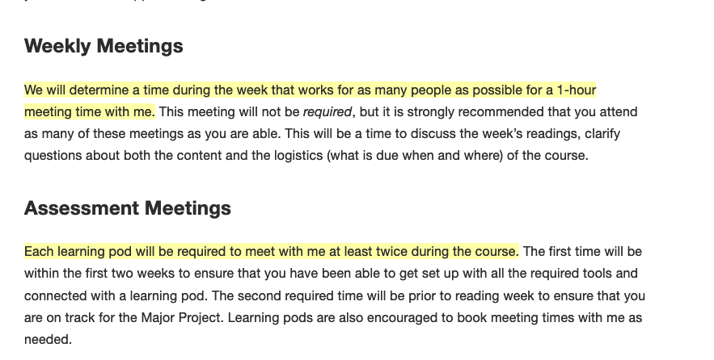
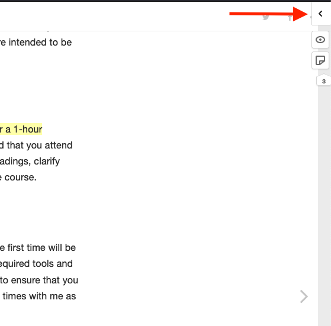
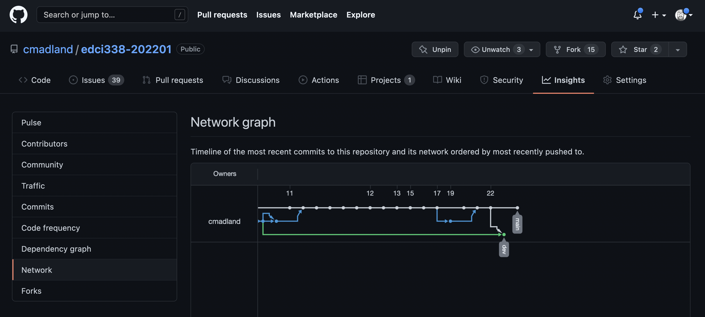

# Updates {-}

```{block, type='reflect'}
#### Note

I've reversed the order of the updates on this link so the newest updates are at the bottom of the page. That is because having the newest at the top would have created a disaster of a Table of Contents on the left side of the page. Sorry for the change.

Click the link to the current week in the ToC to navigate to the current updates.

```
## Week One (Jan 10-16) {-}

Hello everyone and thank you for joining this course! 

My name is Colin Madland and I will be your instructor for this Spring 2022 cohort of EDCI 338, *Social Media and Personalized Learning*. I am a PhD candidate in the Educational Technology area of the Faculty of Education, where I am researching assessment in higher education. You can learn more about me and my research on my [personal website](https://cmad.land) and follow me on [Twitter](https://twitter.com/colinmadland). I live and work in West Kelowna, BC, on the [traditional, unceded, ancestral lands of the `syilx` people](https://wfn.ca) and I am grateful to be a guest here.

When I am not working on my reasearch, or my day-job at another BC university, I really enjoy riding my bicycle, cooking all sorts of deliciousness on my grill, and hanging out with my family, which includes my wife, 2 two sons, 1 daughter-in-law, 1 daughter, 1 son-in-law, and 1 grandson. Some people might include the fur-bearing beasts (a dog and a cat) in the 'family' category, I know they certainly do!

I'm going to be honest with you (hopefully that isn't surprising...) and perhaps a bit vulnerable. I'm teaching EDCI338 for the first time this spring, and the course requires a significant investment in learning to use some technologies that you and I both may not be entirely familiar with. There aren't really any good ways to think deeply about social media without actually engaging in social media. That can be really challenging, especially in the midst of the ongoing dispruption of our lives due to COVID-19. Disruption can take many forms, from being physically sick with COVID, to having family members and friends being affected, to losing jobs, and on and on. As a result, it can be really hard to focus on learning. So, I want you to understand from the very beginning that it is my *responsibility* in this course to do whatever it is that I can to support your success.

```{block, type='reflect'}
#### 💯 My commitment to you...
**I am committed to helping you achieve success in this course, and I trust you to contact me if you have questions or concerns.**

```
I hope you will find that you are welcome to approach me through whatever media I've published. Admittedly, sometimes I miss notifcations, but that is not on you. I encourage you to be persistent if you haven't heard a reply after a day or so.

### Getting Going {-}

During this first week, it will be important to start getting comfortable with a couple of the tools we will use for the course. There is a [WordPress Setup](https://cmadland.github.io/edci338-202201/wordpress-setup) and a [GitHub Setup](https://cmadland.github.io/edci338-202201/github-setup) page with instructions for how to get started with those two tools. It will be important for you to get started with these tools as they will be critical to your work in the course.

I have created a poll to help us decide on a weekly meeting time, but for this week, let's meet at 9:00am Pacific time in Zoom at the link that I sent in the announcement from Brightspace

```{block, type='todo'}
#### Things To Do This Week
✔️ Read the syllabus, which will be [posted in Brightspace](https://bright.uvic.ca/) early this week.  
✔️ Sign up for a [WordPress site](https://cmadland.github.io/edci338-202201/wordpress-setup).  
✔️ Register for a [GitHub account](https://cmadland.github.io/edci338-202201/github-setup).  
✔️ Visit the [course repo on Github](https://github.com/cmadland/edci338-202201) and create a `Learner Profile` issue (click `Issues` to get going...).  
✔️ Sign up for [hypothes.is](https://hypothes.is) and [join the `edci338` private group](https://hypothes.is/groups/KPPbMpdo/edci338).  
✔️ Annotate the [Course Details](https://cmadland.github.io/edci338-202201/course-details.html) and [Assessment](https://cmadland.github.io/edci338-202201/course-assessment) pages with your questions, comments, concerns, or other observations.
```

---

### Week One - Wednesday, Jan 12 {-}

It's good to see you starting to register your WordPress sites, signing up for GitHub (BTW, don't choose a paid plan!), and submitting your first issue to the 'Learner Profiles'. [You can see others who have submitted their issues as well at this link.](https://github.com/cmadland/edci338-202201/issues) While you are there, you can click on your own issue and add a label to align yourself with a Learning Pod.


Also, in the EDCI338 repository that you created in your own account, please go to 'Settings', then 'Manage access', and click the green 'Add people' button and add me as a collaborator to your repository. My GitHub username is `cmadland`. Since the Learner Profile issues you created in the course repo are public to the course, we will use your own private repository to track your work and have assessment conversations.


```{block, type='protip'}
#### ✨ ProTip{-}
It is perfectly normal to feel a bit overwhelmed or intimidated at the beginning of a course. EDCI338 has a bunch of front-loaded set up in technologies, and that always takes time. Please be patient with yourself and don't hesitate to reach out if you need assistance.
```

---

### Week One Mini Update - Thursday {-}

```{block, type='gh'}
#### GitHub

In the spirit of learning together, I've learned that I need to add you as collaborators on the course repository in order for you to use your Learner Profile issues to organize Learning Pods. Those of you who have created your Learner Profiles in GitHub as of 4:45pm on Thursday have been invited as collaborators and should see an email in your inbox with the invitation.

Once you are a collaborator, you will be able to add the Learning Pod label to your profile..

```

---


### Weekend Update 1 {-}

...not that Weekend Update.

Happy Saturday, at least I hope it is for you! For those of you in Victoria, stay away from the beaches for a bit until the tsunami warning is lifted! 

As of this morning, 19 of you have signed up for a GitHub account and created your Learner Profile in the course repository. Thank you for doing that. I know that everyone has different schedules, and in the past, most learners in my online classes do most of the work over the weekend. I anticipate a good number of you will be able to get going today and tomorrow.

Just a reminder that you won't be able to add the learning pod label to your learner profile until after I have added you as a collaborator in the repo. So far, I have added everyone who has submitted a Learner Profile issue, but there are a few of you who have not accepted that invitation. You can see the invitation if you sign in to Github and visit the course repo. There will be a blue notice towards the top of the page.

As I mentioned previously, it really is important to get a good start becoming familiar with the technologies we will be using this term. Technology is a significant part of the ***content*** of this course, not just the medium for communication. If you are having challenges, please reach out to me as soon as possible! I've published in Brightspace (look in the Content navigator) a link you can use to book an appointment. I encourage you to book as a learning pod or as an individual.

Good to see several of you annotating the course book using Hypothes.is! While you are welcome to post publicly, I have created a private group for EDCI338 if you would prefer to use that. Check out '[Things to do this week](https://cmadland.github.io/edci338-202201/updates.html#things-to-do-this-week)'. You will notice that there are several points in the course book where the text is highlighted, as below:



These are annotations using hypothes.is and you can access the tool by clicking the little arrow in the top right corner of the course book.



Then when the overlay opens, you'll be able to sign in or sign up to annotate the page.

Hypothes.is is active throughout the book, so you can use it to ask questions about any page...even this one. If you do that, then answers to your questions will ba available to the whole class. Wins all around!

```{block, type='caution'}
#### 🕐 Class Meeting Times

The class meeting time poll has closed and the most popular time (8 votes out of 14 people who voted) was [1:00pm on Fridays - Click to see a time Zone Converter](https://www.timeanddate.com/worldclock/fixedtime.html?msg=Course+Meeting+Time+%28Weekly%29&iso=20220121T13&p1=1091) . I usually like to meet earlier in the week, but I'm happy to fit the course schedule and rhythm to what works for most of you.

Please let me know if you or your learning pod need to connect! I'm happy to make time for you.

```

I'll end with this...

 

[Direct Link](https://twitter.com/jodyvance/status/1481855354023514113?s=20)

Have a good weekend!

---

## Week Two (Jan 17-23) {-}
 

Thank you all for your work over this first week to get started with both WordPress and GitHub, and a bit of hypothes.is. Over the next couple days, I will get your blog links and feeds set up on the course hub so that you'll be able to find each others' thoughts and reflections. I have sent invitations to everyone who has submitted a Learner Profile issue on the course repository. If you haven't yet completed that task, please do so as soon as possible this week to ensure you can join a Learning Pod.

This week, we will begin looking at, thinking about, talking about and reflecting on what it means to be a participant in this "gnarly hairball", as danah boyd writes, of a digital culture we live in. We are interconnected in ways that we neither recognize nor give assent to, yet there are those who argue that we can use these same connections to derive significant relational value with other people. Social media is evolving tremendously rapidly (TikTok is only 5 years old and is already forcing YouTube and Instagram to change their approaches), and in many ways, careful thought about the implications of all this has not been at the forefront.

We will think a bit about the importance of both building a network of allies and also the challenges of TMI (too much information).

#### Week 2 Readings {-} 
To get started, here are four articles and blog posts you should read:

- [What is a Personal Learning Network?](https://www.futurelearn.com/courses/learning-network-age/0/steps/24644)  
- [What are Personal Learning Networks?](https://www.shiftelearning.com/blog/personal-learning-networks)  
- [Understanding Personal Learning Networks](https://firstmonday.org/ojs/index.php/fm/article/view/3559/3131)  
- [Networked Privacy](https://ojs.library.queensu.ca/index.php/surveillance-and-society/article/view/networked)  

Please read these articles and then engage in some thinking in light of them during the following activities:

```{block, type='todo'}
#### Things To Do This Week
✔️ Read the four articles above.  
✔️ Individually, [use this Canva template](https://www.canva.com/design/DAEo_K9K5q4/e6I7IJotSwXu2X7JFwtOHw/view?utm_content=DAEo_K9K5q4&utm_campaign=designshare&utm_medium=link&utm_source=sharebutton&mode=preview), (or download the Venn Diagram image below, or draw your own) to think about how and why you participate in networked public spaces (the bottom-left circle), and how those ideas interact with your offline life (bottom-right circle), and with some other sphere of your life (top circle). You do not need to publish this, although you are welcome to, so the intent is to get you thinking about how the various circles of influence in your life interact, overlap, or maybe conflict.  
✔️ Meet with your learning pod, ideally before the class meeting on Friday (1:00 Pacific Time) to discuss any questions you had about the readings or the Venn diagram activity. Feel free also to connect with each other about what social media tools you are particularly interested in.  
✔️ Publish your first [Wow and Wonder post](https://cmadland.github.io/edci338-202201/course-assessment.html#community-contributions-and-connections-30) on your WordPress blog. Make sure that your blog link is in your [Learner Profile issue on the course repo](https://github.com/cmadland/edci338-202201/issues) and that you use the category `edci338`.  
✔️ Meet in the course Zoom link (published in Brightspace) on [Friday at 1:00 pm, Pacific time](https://www.timeanddate.com/worldclock/fixedtime.html?msg=Course+Meeting+Time+%28Weekly%29&iso=20220121T13&p1=1091).  

```


### Weekend Update 2 {-}

Welcome to the weekend! I trust that you will be productive, unplugged, connected to support, rested, or whatever you need in whatever measure you require.

It was good to meet with about a third of you on Friday at 1:00 Pacific time. We were able to connect on some questions and get some more detail about using GitHub to manage your work in this course. Fortunately, I remembered to record the shareable parts of the meeting and [post the recording to Brightspace under 'Zoom Recordings'](https://bright.uvic.ca/d2l/le/content/152781/viewContent/1565567/View). Feel free to have a look.

There are a few of you who have joined from the waitlist in the last few days, so welcome to you! [It will be important for you to review the updates from Week 1](https://cmadland.github.io/edci338-202201/updates.html#week-one-jan-10-16) in order to catch up to others in the class. Please let me know if you have questions!

Hopefully, by the end of tomorrow (Sunday) you will have read the four articles listed under [Week 2 Readings](https://cmadland.github.io/edci338-202201/updates.html#week-2-readings) and met with your Learning Pod to discuss the readings, the Venn diagram activity, or any technical questions you might have so far.

```{block, type='protip'}
#### 💭 Remember

It is critical for you to stay in contact with either me or your Learning Pod or both if you are having difficulties! I recognize that there is a heavy technology lift at the beginning of this course, but I am confident that you can learn the workflow.

It will be important for all of you to have completed all of the technology set-up tasks in GitHub and WordPress as we will be using GitHub more next week.

```


## Week Three (Jan 24 - 30) {-}

In Week 3, we are going to dive a bit more deeply into thinking about how you choose to present yourself in digital spaces, where you have control over that, and what you might do to regain control where it is lacking. Hopefully you recall the goals of the course, which include you being able to `explain personalized learning and its relation to learning theory`, and `recognize that the Internet is not a neutral or equal space for everyone`. You also should recall that your culminating post for this course, your [Celebration of Learning](https://cmadland.github.io/edci338-202201/course-assessment.html#celebration-of-learning-30), will require you to demonstrate how you have met each of the outcomes for the course. As such, it's not too early to get started on your Celebration of Learning post as a draft on your site.

### Agency {-}

When you have the freedom and ability to take some specific action, it is often said that you have `agency` in that action. Unfortunately, in life, education, and social media, we sometimes lack agency.


[Link to Tweet](https://twitter.com/ilana_horn/status/1485328016301559817?s=20)

Part of what I hope you will gain or develop in this course is a greater sense of agency over your interactions in digital spaces, whether they be networked and public, or not, and especially with respect to the technologies you might want or be required to use for your university education. Networked learning spaces have presented challenges for traditional models of university education, which has grown out of a long and very stable tradition that prioritizes lectures and the `transmission` of knowledge from the expert to the novice. Contrary to the transmission model, a networked model prioritizes the interactions between nodes in the network as the work of learning happens.

In 2005, George Siemens wrote an influential article in which he outlined a vision of a learning theory for a networked time, which he called `connectivism`. One key argument in the theory of connectivism is that knowledge resides not only in individuals, but in the connections between individuals and that knowledge can be accessed through interactions between them. This is why this course is structured the way it is. By having you work in Learning Pods, rather than as individuals, and having you reference each other's posts, it is intended that you will begin to realize the creation of a networked community. Further, by using GitHub and WordPress, which are both designed with features that enable and encourage lasting connections, rather than Brightspace, which is designed for short-term connections (at best), I hope that you, as a collective, will build a productive and supportive community of learners. 

### Safety and Equity {-}

As a cis-gendered straight white male, I recognize that, if life were a video game (it's not, and I don't mean to trivialize the very real challenges we all face), I would be playing the game on the easiest level. I would have all the cheat codes, my challenges would be eminently attainable, and I would be able to breeze through the game with relative ease and comfort. Others, however, such as members of the LGBTQ+ community, Black or Indigenous people, disabled people, women and especially people who live at the intersection of more than one of those communities are all 'playing' under far more challenging conditions, especially online. As such, many open source software communities have adopted community codes of conduct to ensure that all people have equitable opportunities to participate and contribute to the knowledge of the community. As the open education community has emerged from the open source software community, we too have adopted this practice.

In the context of EDCI338, we are going to use this week to consider our own Code of Conduct. To do so, we will start to use the capabilities of GitHub a little more deeply.

In GitHub, you can go to the 'Insights' tab, and then choose 'Network', where you will see a Network graph, as below (it will be a bit different when you see it as I will have committed changes since then).



In the graph, you can see that there are two 'branches' in the repository. A repository begins with only one branch, called `main`, but users can create branches, or copies, of the main branch in order to test features in the software, or ideas in the course, as it may be. You can see that this repository has two branches, the main branch (white, on the top), and a second branch called `dev` (green, on the bottom). The white line that drops down from `main` to `dev` on Jan 22 is when I merged the two branches by pushing changes I had made in `main` (the white dots) to `dev` so that the two branches were the same. I did this through a process called a `pull request`, or `PR`.

By the time you see these instructions, I will have pushed changes from `main` to `dev` again, but `dev` will be ahead of `main` because I will have made changes on `dev` and started a pull request. The PR is the suggested addition of a Code of Conduct. The Code of Conduct I am suggesting is based on (or forked from) other open source codes, but it doesn't quite fit for application in a course (I think).

Our primary task for this week will be to review the pull request and come to a decision (maybe a consensus, maybe not) about how to proceed. We might choose to revise the code, accept it as is, or create a completely new one...but we shouldn't proceed without one.

To see the pull request, sign in to Github and click the 'Pull requests' tab in the menu just below the title of the repository.

You will see that there will be one open pull request for you to click on. Once in the PR interface, you will be able to scroll down the page to see an overview of the proposed changes. You can get a more detailed view if you click 'Files changed', which will show you a split view of the old file on the left, with deletions in red, and the new file on the right, with additions in green.


In the split view, you can hover over one of the lines in the view to see a blue square with a white + sign. Clicking this plus sign will allow you to make a comment about that particular line.

On the 'Conversation' tab, there is space for a discussion of the PR as a whole at the bottom of the page.

```{block, type='caution'}
#### Caution

The course book at cmadland.github.io/edci338-202201 is being served to the web from the `main` branch, so it will be important that you follow the instructions below carefully!

```

```{block, type='gh'}
#### GitHub

##### Sign in to GitHub.

##### Click 'Pull requests' and find the `Code of Conduct` PR.

##### Click `Files changed` and read through the proposed Code of Conduct.
- Leave comments or questions at points that you think we need to clarify, delete, or maybe revise.
- I have assigned one `Reviewer` from each Learning Pod who will act as the official approver of the code for that particular learning pod, so make sure you come to some sort of agreement.
- Leave overall questions and comments on the discussion at the bottom of the `Conversation` tab.
- After we have discussed any of the issues you might find, I will merge the PR into the `main` branch and the code of conduct will come into effect.

```

As always, please make sure you get in touch with me if you are having challenges!

```{block, type='todo'}
#### Things To Do This Week
✔️ All the things from weeks one and two.  
✔️ Read the [Siemens article.](https://cmadland.github.io/edci338-202201/articles.html#connectivism-a-learning-theory-for-the-digital-age)  
✔️ Read and comment on the GitHub pull request as described above.  
✔️ Publish your second Wow and Wonder on your blog. To clarify a bit...this should be a short post that describes one thing that struck you as important (Wow), and one question that you have (Wonder). Your Wow and wonder posts are required but not graded and they should serve as conversation starters in your Learning Pod meetings.  
✔️ If you are not yet connected with a Learning Pod or [showing on the Blog List page on the course hub](https://edtechuvic.ca/edci338/a01-blog-list/), please contact me as soon as possible!  

```

## Week Four (Jan 31 - Feb 6) {-}

Week four already! I trust you are finding your way in this course as we begin to dig more deeply into what it means to build and maintain a PLN and to interact well in social media environments. These first few weeks, we have been building connections in a few different ways:

- **Asynchronously** as I publish and you read updates here on the course book site.
- **Asynchronously** in Github as I provide some tasks for you and you work to complete those tasks. As of today, everyone should have an invitation to collaborate on the course repository, create a Learner Profile issue, add a label and comment on a pull request. You are welcome to use GitHub to create issues as a group and assign those to me. Doing this will allow the whole class to get answers to common questions rather than those answers being tied up in emails. I have created a 'question' label that you can add to these issues.
- **Synchronously** as we meet in Zoom each Friday at 1:00 PM pacific time to discuss the course. Keep in mind, these meetings are optional and I (usually) record the important parts for your viewing pleasure.
- **Synchronously** in your Learning Pods as you meet on your own time and schedule in a smaller group of people. The Learning Pods are intended to be a spot to ask questions of each other, review your wow and wonder posts, and will become your group for building the Major Project.

Hopefully, you will begin to realize the beginnings of a PLN within the community of EDCI338. I am often asked by learners who they should follow on social media, and my first recommendation is always that they should follow their classmates as building a PLN among the people you go to school with can be tremendously powerful over the years after you graduate.

This week, we look at some issues related to privacy and how that might influence how you choose to share your life and world with web tools. Many people have had the experience of having to click through an End User License Agreement (EULA) in order to use a service. ***Far*** fewer people have actually read what that EULA actually says, and part of that is by design. Those *Terms of Service* or *EULA*s are loooooong and filled with legal language, and much of the most important language is in ALL CAPS, which makes the text much more difficult to read.

### Digital Privacy {-}

It is second nature to most to take selfies and share them on Instagram, Snapchat, etc., but once you move into the role of an educator in either a public or private context, you must adhere to the laws set out by the [B.C. Office of Information and Privacy Commissioner](https://www.oipc.bc.ca/). Their office has put together guidelines for both public bodies and private bodies. TWU, as a private body is not held to the same standard as public bodies, but we should strive to meet the same standard. The guidelines for public bodies to better understand what the rules are is linked below and how to get consent is detailed on page 4 of the [BC Cloud Computing Guidelines (PDF)](https://esquimalt.public.sd61.bc.ca/wp-content/uploads/sites/34/2013/09/OIPC-Cloud-Computing-Guidelines-for-Public-Bodies.pdf) and you can review the [Freedom of Information and Protection of Privacy Act here.](http://www.bclaws.ca/Recon/document/ID/freeside/96165_00). [TWU also has a privacy policy, available here.](https://www.twu.ca/about/university-privacy-policy)

Each public body will have their own process (which may range from not allowing  tools to pressure to integrate networked learning tools from outside of Canada), so it is important to understand your own setting and the law. You may find some administrators or staff breaking these rules or not aware of them. It is important for you to enter your field and uphold the law, regardless of the culture you enter. This does not mean that you do not engage online or outside of Canada. It means that if/when you do so, that you understand the steps, which are not much more complex than the consent you would get normally for going “on the Internet,” as is described in most settings, but you must name the date consent is effective and, if applicable, the date it expires. It is important that you work with your school district on the consent process. You can see an example of how K-12 school districts are addressing access to cloud tools outside of Canada [here (Coquitlam)](http://www.sd43.bc.ca/Resources/DigitalCitizenship/Pages/CloudTools.aspx) and [here](https://www.sd61.bc.ca/programs/digital-learning/sd61-gafe/privacy-and-personal-information/) plus [here (Victoria)](https://techforlearning.sd61.bc.ca/privacy/consent-process/). You must also name each tool individually. It cannot be “blogging.” You must name WordPress.com or Blogger, etc. If you use Flipgrid, you must name Flipgrid. Consent must also be informed, so effort must be taken to ensure that those signing consent understand the implications – that their data may leave Canada, how it may be harvested, and to know about the U.S. Patriot Act. One archived resource by the Canadian Treasury Board provides significant detailed information about the [Patriot Act here](https://www.tbs-sct.gc.ca/pubs_pol/gospubs/TBM_128/usapa/faq-eng.asp). It is helpful to also review [section 4(b) of the B.C. Digital Literacy Framework which is applicable K12 contexts](https://www2.gov.bc.ca/assets/gov/education/kindergarten-to-grade-12/teach/teaching-tools/digital-literacy-framework.pdf) but helpful for others.

Additional resources can be found here:

[Privacy Education for Kids](https://www.priv.gc.ca/en/about-the-opc/what-we-do/awareness-campaigns-and-events/privacy-education-for-kids/) by the Office of the Privacy Commissioner of Canada

[Information Security Awareness](https://www2.gov.bc.ca/gov/content/governments/services-for-government/information-management-technology/information-security/information-security-awareness) by the BC Government

[MediaSmarts: Canada’s Centre for Digital and Media Literacy](http://mediasmarts.ca/)

##### FIPPA, Privacy, and Consent Competencies {-}

Learners should ensure that they:
- Are aware of the OIPC, FIPPA, and the Cloud Computing Guidelines and follow them
- Understand what constitutes personal information
- Understand that privacy online is a personal choice and must be respected
- Understand if that you assume an “educator” hat, you have a duty for those under your care, their parents and families, and your colleagues with regard to their privacy and protection of personal information
- Are aware that the Canadian federal government states that the chances are remote that the US Patriot Act will access personal information of Canadians, but recognizes that it is our responsibility to protect privacy preferences and to ensure that consent obtained is informed consent. Some families may be involved with restraining orders and need to be private for their safety, but the reasons for privacy may be preference. Either way, it is not our business as to the reasons for privacy preferences, but it is our responsibility to uphold preferences.
- Understand how media moves through networks into US cloud-based services (e.g., back-ups on iTunes, syncing with Dropbox, messages with personal information is sent on Gmail, Google Docs, blog RSS subscriptions, etc.)
- Understand that these acts do not prohibit participation in networked tools outside of Canada and many public bodies are in need of staff and leaders who model networked literacy and positive citizenship online for their community
- Understand what appropriate consent looks like for public bodies and is aware of what alternative steps are to support learners when consent is not obtained.

### Residents and Visitors {-}

We will also explore a bit the idea of *Visitors* and *Residents* in digital spaces. You have likely heard that younger generations are ***digital natives***, while older generations are ***digital immigrants*** indicating that younger people are totally at ease with technology since they grew up with it, while oder generations have difficulty with technology. 


I'd like to introduce you to a different way to conceptualize your relationship with digital media, and that is that you may be a *visitor* in some web spaces and a *resident* in others. Places on the web where you might be a visitor are those places where you, quite literally, visit, but importantly, don't leave a public trace of your time there. You don't spend any time interacting with people, but rather, you take a rather utilitarian approach by visiting a site, doing a thing, and leaving.

Alternately, there are places and spaces on the web, where *you* reside as a persona, where you interact, socialize, and leave traces of yourself online. For some, that may be Facebook, where you keep in touch with friends and family, or Twitter, or maybe it's any number of social sites like Instagram, TikTok, SnapChat and others. The important distinction is that these are places where you connect with other people; where you are socially *present*.

At the same time, if we can imagine the visitor <--> resident continuum on a horizontal axis, there is also a personal <--> professional (or educational) continuum on a vertical axis, leading to 4 quadrants where you might situate your technology use.

[This video explains a process to help you think about where you reside on the web (7 mins).](https://www.youtube.com/watch?v=sPOG3iThmRI)


I've shared my VR Diagram below...keep in mind that this diagram represents a set of tools that I have been using for a decade or more and that I have invested my career in educational technology. There is a lot here, but yours might look significantly different with only a few tools here and there. The main thing I would like to communicate with this idea of visitors and residents is for you to think about which technologies you use as a resident, and then to think about where your learners reside on the web. From there, we can begin to plan for tools we can use that afford us and our learners the opportunity to reside there.


[OPTIONAL] If you don't already, I encourage you to subscribe to this excellent podcast called *Teaching in Higher Ed* by [Bonni Stachowiak](https://twitter.com/bonni208), or, just take 47 minutes to listen to this episode in which Bonni interviews Dave White about the idea of visitors and residents.

<a class="embedly-card" data-card-controls="0" href="https://teachinginhighered.com/podcast/digital-visitors-and-residents/">Digital Visitors and Residents, with David White - Teaching in Higher Ed</a>
<script async src="//cdn.embedly.com/widgets/platform.js" charset="UTF-8"></script>

```{block, type='todo'}
#### Things To Do This Week
✔️ Complete the [Privacy, Ethics & Security in Digital Spaces Developing Awareness of Privacy](https://digitaltattoo.ubc.ca/quizzes/privacy-and-surveillance) quiz (not that kind of quiz...).  
✔️ Read [Visitors and Residents: A new typology for online engagement](https://cmadland.github.io/edci338-202201/articles.html#visitors-and-residents-a-new-typology-for-online-engagement)  
✔️ Complete your own ***Visitor/Resident*** map and share and discuss it with your Learning Pod. You can use the [tool that is provided here (DON'T forget to screenshot it, or you'll lose it!)](https://experimental.worldcat.org/vandrmapping/editMap), or use a different tool like [Canva.com](https://canva.com)  
✔️ Publish your third Wow and Wonder post based on your Visitor/Resident map and what you learned about privacy.  
✔️ [Optional] Consider in your Wow and Wonder post what a potential employer might find based on your map if you applied for a job with them.   
✔️ Set up a time with your Learning Pod to meet with me sometime this week. Please use the link published in BrightSpace, or submit an issue in Github.  
✔️ Looking forward, your first [Showcase post](https://cmadland.github.io/edci338-202201/course-assessment.html#showcase-posts-2-15-each), based on one of your Wow and Wonder posts, is due at the end of next week (February 13).  
```

## Major Project Update {-}

Good morning/afternoon/evening! I trust you are all well.

This update will provide a mechanism to get you started on the [Major Project.](https://cmadland.github.io/edci338-202201/course-assessment.html#major-project-40) As a reminder, the major project is worth 40% of your final grade and will require some sustained effort over the second half of the course.

I will be publishing details of the project as it unfolds on the [Major Project page](https://cmadland.github.io/edci338-202201/major-project) starting today.

