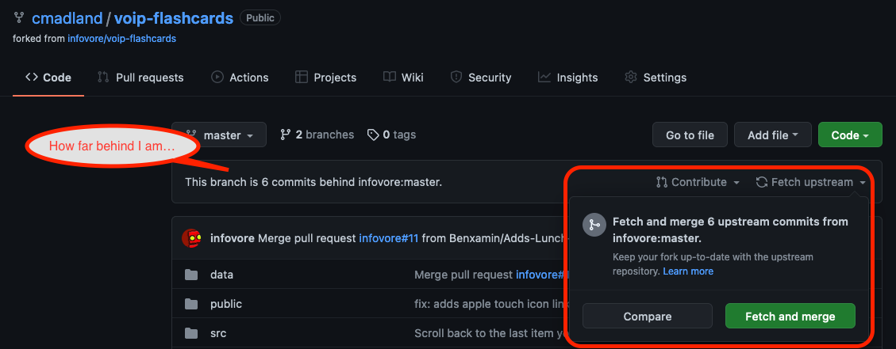
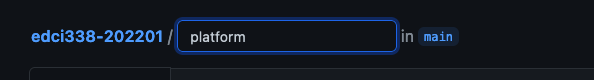
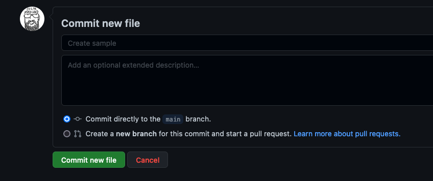

# GitHub Setup {-}

Github will be the main location of our collaborative work in EDCI338. While Github was created for teams to collaborate on coding projects, it can also be used for many other projects. Some of the language around interacting with Github might be new to you, but that is ok, it will seem foreign at first, but the whole point of you taking this course is to learn new skills, right?! I'm here to help.

The first thing you might notice is that there are some weird punctuation marks in the raw text in Github. That is called `Markdown`, which is a way to tell web-browsers how to style text. The basics are super easy to learn, and they map pretty well to what you might do in a word processor. For example, in MS Word, if you want to indicate a heading, you put your cursor in the text, and choose the `Heading 2` style. You can do the same thing in Markdown by simply adding two hashtags and a space before the text, like this...

`## Markdown`

Which shows up on the page like this...

## Markdown {-}

Each heading level uses the corresponding number of hashtags.

### Heading levels {-}

```
# Heading 1
## Heading 2
### Heading 3
#### Heading 4
##### Heading 5
###### Heading 6
```

### Styling text {-}

You can also style text as *italics* `*italics*`, or **bold** `**bold**`, and you can also stack codes so ***bold italics*** `***bold italics***`.

### Lists {-}

You can quickly and easily create an unordered list (bullets) with either a `*`, or a `-` followed by a space...

```
- berries
- fruit
- vegetables
```

- berries
- fruit
- vegetables

You can create an ordered list by doing the same with a number and a `.`...

```
1. Cycling
2. Running
3. Rowing
```

1. Cycling
2. Running
3. Rowing

### Hyperlinks {-}

[Put the text you want to display between square brackets, followed by the URL in parentheses](https://edtechuvic.ca/edci338)

 `[Put the text you want to display between square brackets, followed by the URL in parentheses](https://edtechuvic.ca/edci338)` 

### Images {-}

Images use the same syntax as hyperlinks, except they use an `!` at the beginning, so...

`` renders to


The difference with images is that you need to make sure the image is physically in the same repository that you are working in. In this case, the image is in the `assets/w1/` folder.


```{block, type='todo'}
#### Things To Do in GitHub
✔️ Register for an account.  
✔️ [Create a new repository](https://docs.github.com/en/get-started/quickstart/create-a-repo) called `EDCI338`  
    ✔️ choose 'Private' in the visibility settings (step 4, above)  
✔️ Go to the [course repository](https://github.com/cmadland/edci338-202201)  
✔️ Click `Issues`, then `New Issue`, then `Get Started` to create a Learner Profile for yourself.  
✔️ If you know who will be in your learning pod, please add the `Label` to your issue that corresponds with your Learning Pod, otherwise, you can just add a label that has fewer than 4 members already.
```

## Fork, Pull, Fetch {-}

Sometimes the lingo of Git and GitHub can be a bit confusing, and perhaps like there are too many steps to just save some work. Admittedly, the language does take some time to learn, but it is rather intuitive once it is explained.

The way that we are using GitHub (editing content directly within the web interface) isn't the typical workflow, but that is ok.

You should think of the [course repository, which I own,](https://github.com/cmadland/edci338-202201) as the `remote`, meaning that it is the content stored on the web, not on your computer (which would be `local`). When you edit on GitHub, you have limited permission to make changes in that you can't make changes directly to my repository, but rather, you need to propose changes, and ask me for permission to change the repository. You do this by creating a `pull request`, which is just you telling me that you have some proposed changes and asking me to `pull` them from your proposal into the repository.

Creating a pull request like this is what allows us to collaborate on the repository without your changes overwriting the course materials.

This creates a fair amount of friction in that you need to wait for me to approve your changes before you can proceed.

There is a way around this though, and that is by creating a `fork` of the repository (several of you did this at the beginning of the course already). A fork is an exact copy of a repository at a particular point in time. So if you forked the course repo on January 14, you would have a copy of the course materials as they were on Jan 14, but there would be a notification that your copy is `x` number of `commits` behind the remote repo. If that is the case, you can catch up to the remote by clicking `fetch upstream`, then `fetch and merge`.



Once you have a fork of the repository, you can make all the changes you want to ***your*** copy of the repository, then, when you are ready, you can open a pull request to have your changes merged into the main repo.

```{block, type='protip'}
#### ✨ ProTip{-}

For EDCI338, you need to have ***ONE*** person from your learning pod with an up-to-date fork of the course repository, then the other people in the learning pod should fork that repository. for example, the main repo is at *cmadland/edci-202201*, and Chloe has a fork at *chloelyh/edci338-202201*, so each of Chloe's learning pod members should fork *chloelyh/edci338-202201*.

```

With this setup, each learning pod can be working on their own repo without any need for me to approve changes before they continue. then, when they are ready, each learning pod member opens a pull request with Chloe, who merges all the changes into her repo, then opens a pull request with my repo to merge all of those changes to the main. This way, each individual learning pod members' contributions are recorded along with the learning pod as a whole.

## Adding an Image {-}

Adding images requires a little bit of work, as it isn't drag and drop like you might be used to in your word processor. That said, it's relatively straightforward.

### Add a folder {-}

#### In your repository, click the `assets` folder, then click `Add file`, then `Create new file`. {-}


This step will only create a new folder for you; you won't add the image yet.

#### Enter the name of your social media platform and then type a `/` (this step is important!!) and then type a random word like `sample` or `placeholder`.{-}




#### Commit and push your changes. {-}

Since this is your own repo, you will be able to commit directly to the main branch of your repository.



You will then have a folder with the title of your social media platform inside the `assets` folder. There will be one file inside your platform folder, but you can ignore or delete it.

#### Prepare your image file. {-}

Your image should be relatively small (under 1MB), so if it is too large, you can compress it with [tinypng.com](https://tinypng.com). The filename should be as simple as possible; one word is ideal. Don't use any capital letters, punctuation, spaces, or symbols other than `-` or `_`. 

#### Upload your image. {-}

Click into your new folder, and click `Add file`, then `Upload files`. You can either drag and drop your image, or navigate to the file on your computer.

#### Commit your changes. {-}

[Here is an instructional video highlighting this process](https://echo360.ca/media/78a94f67-7fa5-4930-924e-ae45330633cd/public?autoplay=false&automute=false)

[See the instructions above for adding an image to a page.](https://cmadland.github.io/edci338-202201/github-setup.html#images)
