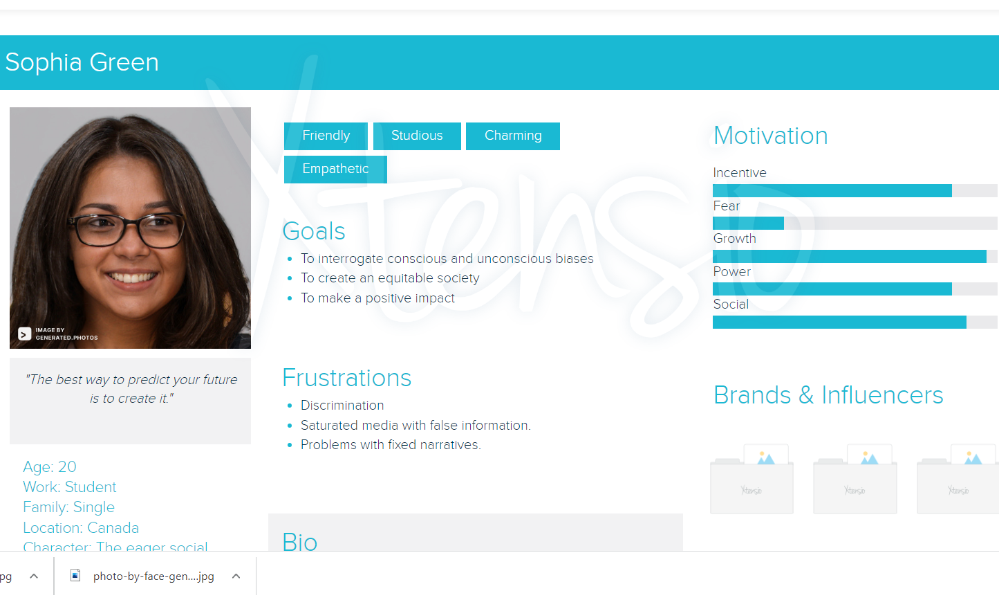
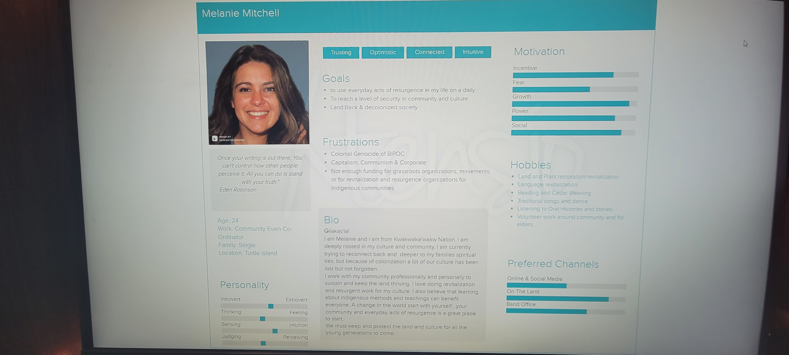
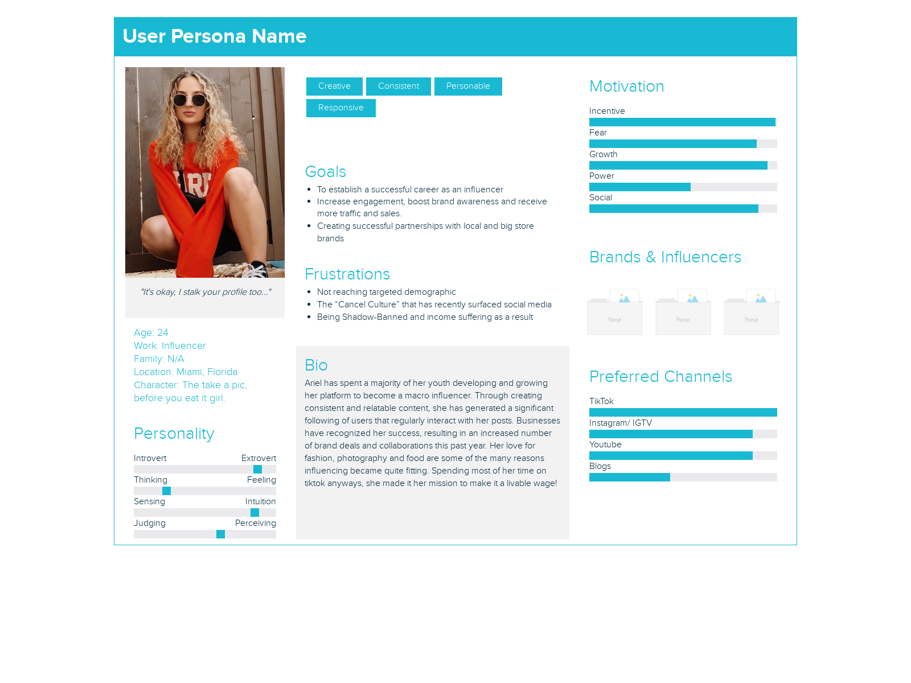
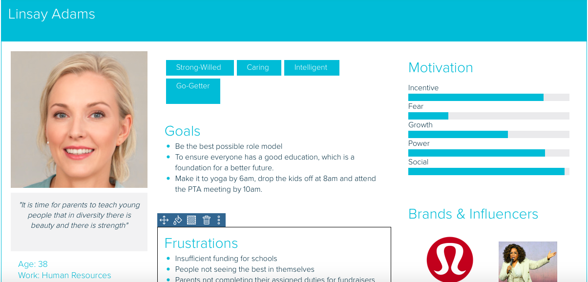
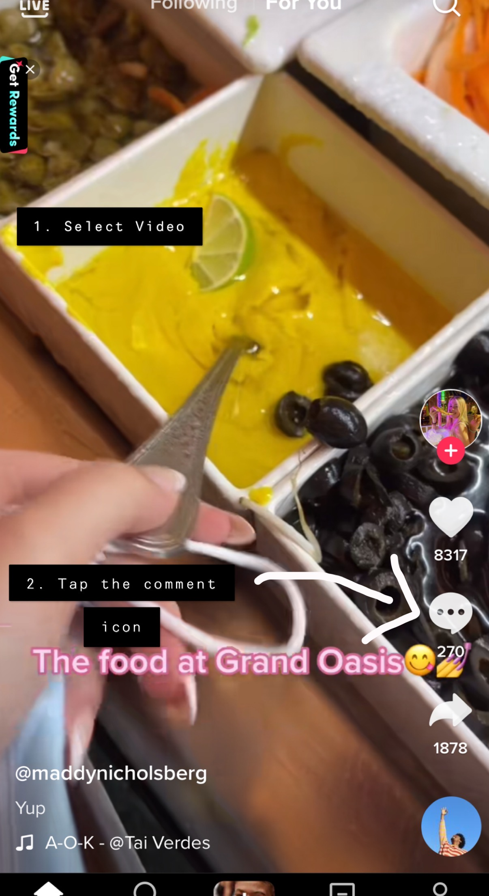
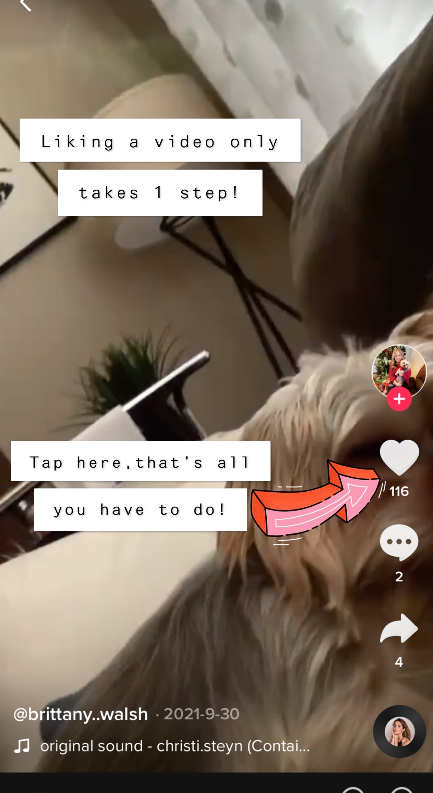
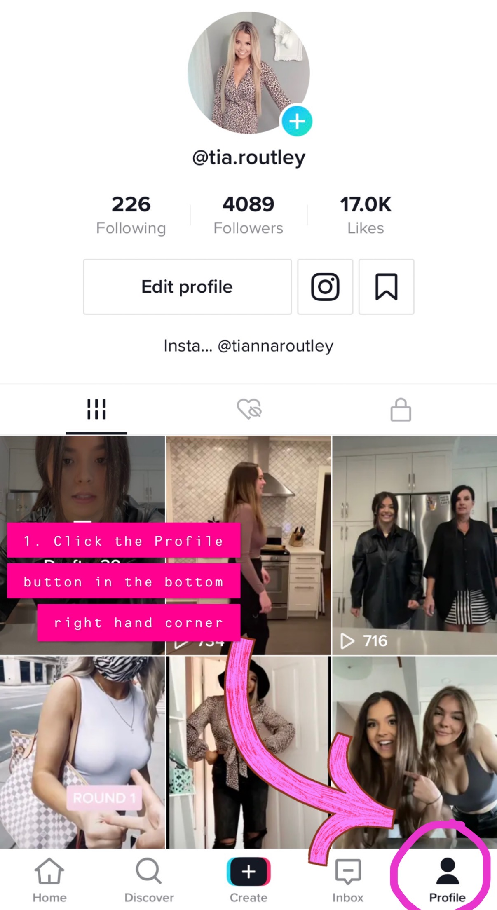
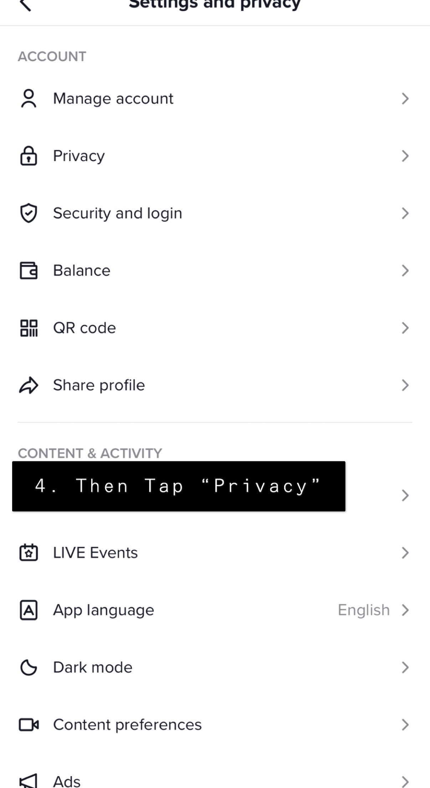
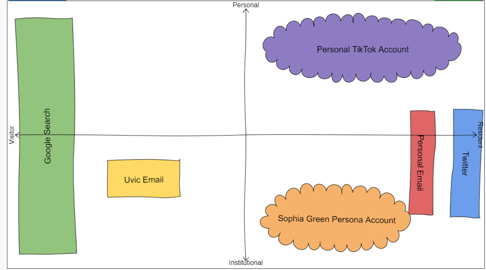

# TikTok

## Persona {-}
 
 

## Demographics {-} 

### Target Audience and Users {-}

 Tik Tok is available in over 150 countries, storing the information of over 1 billion users. The widespread population of users has approximately 120 million users residing in the United States, 87 million from Indonesia and 72 million in Brazil. Surprisingly, Canada does not currently make the shortlist of countries (top 10), that hold the greatest number of users. Owed to the increase of technological advancement, it is evident why the main demographic of consumers is what is commonly referred to as the “Gen Z”. A totalled 60% of users match Gen Z’s age group (individuals born between the years of 1997-2012) with a majority aged between 10-25 (Wallaroo, 2022.). With that being said, it should be noted that TikTok requires its users to meet the minimum age requirement of 13 years old. 
 An older demographic of seniors can be seen on this app too, though they constitute an unusual subset. Similar success has been recorded of older generations, with great traction and activity on their platforms. To name a few, oldgays is a group of older men that share their thoughts and opinions on life, and cookingwithLynja shares insight on how to make yummy meals in a quick and easy fashion. 
 In comparing the gender of TikTok’s users, there is an obvious breakdown of genders and their active use on the app. To date, identified females make up the majority of users with a remainder of male users (39%) and others (2%) constituting the rest. TikTok targets individuals with interests and hobbies of all sorts. Promising a guarantee for users to be matched with creators that align with their hobbies and interests, running from fashion to baking, dance and/ or travel. 
 Tiktok has enabled users to create business accounts to allow for easy, accessible and reviewal of the accounts analytics. Businesses in particular have greatly utilized the analytics page to pinpoint the age, gender, and likes of their active users. The information received from the analytics, successfully supplies and equips companies with the proper tools to adapt and  progress. 

^[Wallaroo (Ed.). (2022, March 24). Tiktok statistics - everything you need to know [Mar 2022 update]. Wallaroo Media. (https://wallaroomedia.com/blog/social-media/tiktok-statistics/)]

#### Non-users {-}

TikTok does not require users to create an account to browse the platform. There are a variety of methods that allow non-users to navigte the platform. With a few simple steps, users that do not wish make an account are able to view the content. 
The first option consists of following three simple steps:
1. Go to TikTok.com
2. Select “For you” on the left sidebar 
3. Begin watching videos without logging into an account

Videos made and created on TikTok’s platform can also be viewed on other neighbouring media platforms. Multiple channels on youtube have dedicated their content to uploading what is currently trending on Tik Tok. Content creators of youtube make it possible for users without an account to gain quick and easy access to like and comment on the video on youtube. 
TikTok videos may also be viewed without an account if they’re sent by message, Snapchat, email, Facebook etc. 
With that being said, there are a variety of features that can not be accessed by users without an account. Guest users features are restricted and they are unable to follow creators, like videos, see or write comments on the videos, upload or share content or join creators ‘lives’.

#### How Users are Connected {-}

TikTok features allow users to generate communities online. Users can stay connected through the act of sharing, following, commenting or liking other creators’ posts. Simply by locating and following a creator’s account, their videos will be readily available for viewing in the “following” section of TikTok. Unless the creator’s content is made private, a user does not need to wait for access to be granted, in order to proceed in viewing the video of the account. Furthermore, there are no obligations for users to follow one another back, however, access to the creator’s videos is still made available regardless of mutual following. 
 There exists two types of pages to view content. The ‘for you page’ showcases viral Tik Toks and creators of all sorts. This side of TikTok may allow users to discover new creators they wish to connect with or follow. After the user has followed the creator, their content may now exist on the other side of TikTok. 
 Separated into two sections, the videos published by the users following will appear on the ‘following’ page, while other creators will appear on the “for you page”. The users following page exists to serve individuals with accessible access to their favourite content creators and avoid missing out on their friend’s and families’ posts.
 Another way to interact on TikTok is to engage in creators’ “lives”. Users may choose to go live to interact with their followers in real-time. By sharing insight into their daily living, creators have found great success expanding their followers and creating user engagement. Another unique feature allows for creators to go live with other fellow creators on the app. TikTok lives provide users with access to comment, ask questions and send or receive gifts. Although, TikTok requires users to meet a following of 1,000 and be 16 years of age in order to host a live. 

### Content {-}

#### Content Sharing {-}

On TikTok, users have the ability to share any post they see on their feed. In order to share a video, users must tap the arrow located in the bottom right hand corner. Once the user has clicked the share arrow, a variety of methods to share are displayed. These options include the ability to share the video through copying the link or sharing it on another social media platform such as Snapchat, Messages, Facebook messenger or Instagram.  

#### Privately Sharing Content {-}

When a user initially creates a TikTok account, the videos and comments are set to be public. This means any TikTok user can access the content and follow the account. However, TikTok does have Privacy settings that allow the account to be changed to private. When the account is set to private, the account holder can approve or deny follow requests and only their approved followers can view the content. 

Even if the account is set to public, the account holder has access to edit the privacy settings on individual videos. These privacy settings allow users to allow everyone access, only the followers that users follow back, or only the account holder to view the video.

 

#### Viral Content {-} 

Content published on TikTok has the ability to go viral any time a user creates and uploads a public video onto their account. If the content a user creates gets picked up by the TikTok algorithm, it will be shared to other users via the “For You” page. Based on the user's interests and past interactions with TikTok videos, the platforms analytics curates a "For You" page of video content from creators the user may not follow. The algorithm utilizes users’ data on interactions with videos such as the screen time of watching a video, liking the video, and/or sharing it.

 

Once the video makes it to the “For You” page, it has the opportunity to go viral. As a video receives more comments, likes, shares, and duets, the greater its chances are of being picked up by the algorithm. The completion rate of a users’ videos is an additional factor that influences ranking. In short, the more a video is liked and fully watched, the greater it’s chances are of going viral.
^[Worb, B.(2022, January 14). How Does The TikTok Algorithm Work? Here's Everything You Need To Know. Later Blog.
https://later.com/blog/tiktok-algorithm/#:~:text=According%20to%20TikTok%3A%20%E2%80%9CThe%20system,not%20interested%20in%2C%20too.%E2%80%9D]

### Business Details {-}

#### Private Parent Company {-}

The founder, Chairman and former CEO Zhang Yiming created ByteDance in 2012 and developed the video sharing app TikTok aswell. ByteDance, Tiktok's parent company, is based in Beijing, storing the information of over a billion users worldwide. As the name implies a parent company serves to control the interests of another company. The parent company is privately owned by a Chinese tech company, with no opportunities for other interested parties to buy in. 

#### Major Investors {-}

Despite the main ownership of TikTok being owned by the Beijing-based tech company commonly referred to as “ByteDance”, in recent years pressure by the Trump Administration forced Bytedance to expand and create a new company referred to as TikTok Global.  These steps allowed Americans to feel safe about the storing and gathering of their citizen’s information, as opposed to China potentially using it to gain insight and track Americans. To date, the current minority owners are Oracle and Walmart. Oracle holds a 12.5% stake in the company, with Walmart at 7.5%.

#### Revenue Generated {-} 

The business model of leading social media apps are quite similar to one another and lead to the generation of profits. While TikTok is free to download, the network does exceptionally well from paid advertisements and in-app-purchases. Scrolling through the “for-you” page, embedded in-feed ads will begin on auto-play. Tiktok will direct ads based on the user’s interactiveness with certain content. This is very helpful for businesses to grow, network and generate profits, however, the current cost of in-feed ads start at a minimum of $10 per Cost Per thousand/ mile views (CPM). Furthermore, there also exists brand-takeover ads, which begin to play an ad from the moment the app is launched. Businesses may prefer to buy into these ads, to grab the attention of their target audience while they are most attentive. To view ads, a more prestigious form of advertising consists of longer adds up to 60 seconds that pop up during the duration of a user’s activity on the app. Branded hashtag challenges also exist to create brand awareness. The hashtag appears on the discovery page as a fun way to boost user engagement and get messages across. Lastly, branded effects offered by TikTok allow businesses to purchase custom stickers or filters that can be used by users on TikTok for a period of 10 days. As for in-app purchases, TikTok has utilized virtual coins to be purchased and shared among its users. Ranging from 100 to 10,000 virtual coins, the price can vary between 99 cents- $99.99. The in-app currency allows users to show appreciation for the content they engage in and enjoy!

^[Kibet, L. (2021, April 23). How does TikTok make money? GOBankingRates. (https://www.gobankingrates.com/money/business/how-does-tiktok-make-money/)]

## Privacy and Surveillance {-}

### TikToks ToS and Privacy Policy {-} 

[Terms of Service](https://www.tiktok.com/legal/terms-of-service?lang=en)
[Privacy Policy](https://www.tiktok.com/legal/privacy-policy-row?lang=en)
[Privacy Policy for Younger Users](https://www.tiktok.com/legal/privacy-policy-for-younger-users?lang=en)

### Key Takeaway's from TikToks Privacy Policy {-}

 TikTok's Terms of Service (ToS) and Privacy Policies (PP) are both legal contracts that bind the platform and its users. It is not surprising that the tenacity of the ToS and PP of TikTok is impossibly long and hard understand a single word, it would take a week to read and re-read to understand the ToS. The PP and PP for younger users were easier to understand and were significantly shorter than the ToS. By using a keyword search to search for specific words such as 'Privacy' and 'Access' for the general PP, and 'Collect' for the Younger Users PP. Because the keyword search searches all words regarding 'Privacy', 'Access', and 'Collect', it was decided to exclude the times it was mentioned in titles, headings, or weblinks to narrow down the search results. 

According to TikTok, they are not responsible for the privacy policy of third-party partnerships and advertisements that are provided in the app via Cookies ^[[TikTok. June 2, 2021. Para 20](https://www.tiktok.com/legal/privacy-policy-row?lang=en)]. They also note that if a user follows a link outside or from a Third-party source, TikTok is again not responsible or liable for their PP ^[[TikTok. June 2, 2021. Para 37](https://www.tiktok.com/legal/privacy-policy-row?lang=en)]. One single point that seems to be not as invasive was found, but it still does not show to be entirely ethical. It states that if there are any questions, how to use, or want to know if you have any rights in your country, to contact them via email again ^[[TikTok. June 2, 2021. Para 34](https://nam12.safelinks.protection.outlook.com/?url=https%3A%2F%2Fwww.tiktok.com%2Flegal%2Fprivacy-policy-row%3Flang%3Den&data=04%7C01%7C%7Ced2e0d7557fd40b8c7b508da0f6fe370%7C84df9e7fe9f640afb435aaaaaaaaaaaa%7C1%7C0%7C637839270483285606%7CUnknown%7CTWFpbGZsb3d8eyJWIjoiMC4wLjAwMDAiLCJQIjoiV2luMzIiLCJBTiI6Ik1haWwiLCJXVCI6Mn0%3D%7C3000&sdata=CHaGUlTBmeylRs%2BSOVO0QrRDQu2iKWFcMwINCed5NiA%3D&reserved=0)]. this is not a positive point, it seems like they added this in just to say that they mentioned about having rights without actually caring about oneself as a person.

Under the section 'User Content and Behavioural Information' TikTok may collect information such as identifying objects and scenery that appear in the background, location, face, and body attributes from the user's content ^[[TikTok. June 2, 2021. Para 10](https://nam12.safelinks.protection.outlook.com/?url=https%3A%2F%2Fwww.tiktok.com%2Flegal%2Fprivacy-policy-row%3Flang%3Den&data=04%7C01%7C%7Ced2e0d7557fd40b8c7b508da0f6fe370%7C84df9e7fe9f640afb435aaaaaaaaaaaa%7C1%7C0%7C637839270483285606%7CUnknown%7CTWFpbGZsb3d8eyJWIjoiMC4wLjAwMDAiLCJQIjoiV2luMzIiLCJBTiI6Ik1haWwiLCJXVCI6Mn0%3D%7C3000&sdata=CHaGUlTBmeylRs%2BSOVO0QrRDQu2iKWFcMwINCed5NiA%3D&reserved=0)]. The platform may also collect and review users' interests, gender, and age for the purpose of personalizing content, as well as "promoting your content to other users and exploring whether your profile presents further opportunities for collaboration" ^[[TikTok. June 2, 2021. Para 10](https://nam12.safelinks.protection.outlook.com/?url=https%3A%2F%2Fwww.tiktok.com%2Flegal%2Fprivacy-policy-row%3Flang%3Den&data=04%7C01%7C%7Ced2e0d7557fd40b8c7b508da0f6fe370%7C84df9e7fe9f640afb435aaaaaaaaaaaa%7C1%7C0%7C637839270483285606%7CUnknown%7CTWFpbGZsb3d8eyJWIjoiMC4wLjAwMDAiLCJQIjoiV2luMzIiLCJBTiI6Ik1haWwiLCJXVCI6Mn0%3D%7C3000&sdata=CHaGUlTBmeylRs%2BSOVO0QrRDQu2iKWFcMwINCed5NiA%3D&reserved=0)]. These facts can make a user uncomfotable and they may decide to not use the app any further.

When comparing the PP to the Younger Users Privacy Policy (YUPP), it was shocking to see how different they compare. YUPP is significantly shorter than the PP,  there were no drop-down pages, just one simple scroll-down page. A keyword search was used again, but the term 'Privacy had less results than the term 'Collect' was used as it had significantly more results. According to TikTok, they collect limited information only for youth under 13 ^[[TikTok. January 2020. Para. 1-2](https://www.tiktok.com/legal/privacy-policy-for-younger-users?lang=en)]. They collect only the username, password, birthday, and some info about the user's device such as network activity like device ID, IP address, web browser type etc. ^[[TikTok. January 2020. Para. 3](https://www.tiktok.com/legal/privacy-policy-for-younger-users?lang=en )]. These points are so simple and they seem less invasive and more secure than what everyone else must to consent to. TikTok can and may use the username and password to authenticate the user, but it is not clear as to how or why they do that. TikTok also only uses the information for troubleshooting and other analytical services as well as for legal and governmental reasons which not only is rare, but is reasonable as it is law enforcement. ^[[TikTok. January 2020. Para. 4 & 6](https://www.tiktok.com/legal/privacy-policy-for-younger-users?lang=en )].

The difference between these two Policies is significant, so a question arose from this analysis. Why is it riskier for anyone over the age of 14 who are in fact still minors, to use TikTok? It is frightening at how loosely TikTok speaks about Users rights in the PP compared to how much more protected users are in YUPP. All users of TikTok should be under the policies of the YUPP because it seems more serious about the security and integrity of minors than it does with the bigger population which still include minors.

## Social Media and PLN in Education {-}

### Interactions on TikTok {-}

Tiktok serves as a great resource for individuals to interact with other content creators, comedians or those in the arts community. The platform includes a plethora of features that allow its users to comment, like, share and send gifts to their favourite content creators. 

#### Leaving Comments {-}

A comment can easily be made on TikTok with a few simple steps! 
1. Select the video you plan to interact with.
2. From here, you must tap the comment icon located on the right. 
3. Tap the “add comment” box and write a message.
4. Lastly, press send when you’re ready!

^[TikTok (2022). Comments. (https://support.tiktok.com/en/using-tiktok/messaging-and-notifications/comments)]

#### Liking {-}

Liking a video has never been easier for TikTok users. In order to like a video, one can simply tap the heart shaped icon located in the middle right side of the page. 

When a user likes the content produced by a content creator, the like is viewed by the person who made the video. However, it should be noted that unless settings are switched to be private, the video can be viewed by all. Attached below are numerical steps to be followed if one wishes to switch their “like history” to not be viewed by others. 

### Creators {-}

#### Educators on TikTok {-}

Educators use TikTok as a platform to reach audience members from all over the world. TikTok provides a platform for creators to share their voices and knowledge. Videos are created with the intent to educate viewers, answer questions and promote learning. All types of content are currently being taught on TikTok. Educators such as Dad, how do I? provides valuable life lessons and educates viewers on how to fix things. Users can also access Janelle Rohner's content which educates viewers on Keto lifestyles and provides weight loss tips. Depending on the type of content the creators produce, this determines the type of audience members. For instance, Dad, how do I? has an audience of mostly young people while Janelle Rohner’s audience is an older audience as some of the content she shares is keto drinks for those 19+. No matter the topic of interest, there is sure to be a content creator producing educational content on that particular topic.

#### Educators Response to Comments and Questions {-}

A majority of creators prioritize replying and addressing questions made by their audience to create engagement and provide continstency. Comments can directly be responded to in a video, and is often done so by creators. When a question has been asked, educators may produce a video that shows the question being asked and them addressing it. This way, they can directly address the comments and/or questions of their viewers.  An example of this is shown below. 

#### TikTok as a PLN {-}

Educators on TikTok are able to use the platform as a Personal Learning Network (PLN). For instance, TikTok provides educators with a space to share and utilize worksheets, assignments and activities that fellow teachers have created. The growth of TikTok has allowed it to beome a virtual team to distribute and swap ideas. The app can be a great tool for teacher to expand their personal learning networks and gain insight on useful methods employed by teacher alike.

### Educational Post on TikTok Experience {-}
Our group posted the same video on each of our persona's accounts to see the difference in the interactions of users. 

The video posted on Sophia Green’s (persona) account gathered 805 views, 7 likes and 1 follower. This can be attributed to the hashtags #vegan and #sustainable which were placed in the caption. As a result of these hashtags, when someone searches up the hashtag, the video will appear, or the TikTok algorithm could have pushed the video onto users' For You pages based on their interests in those topics. Please click here to see the TikTok post: https://www.tiktok.com/@sophiagreen111/video/7077332572879015173?is_copy_url=1&is_from_webapp=v1

Ariel Fipke, a macro influencer new to TikTok generated a 2 person following. Having  received only 259 views, 4 likes and 1 comment, it became clear she needed to utilize tips and tricks made by fellow tiktok influencers to grow her following and user engagement. Going forward, she may consider utilizing more popular hashtags to increase views. The comment received from a user named @kyleesmithh was “Looks so yummy!! Definitely giving this a try." This comment demonstrates that users do enjoy being shown new, healthy recipes that can be done with just a few ingredients and in a timely manner. This information will allow Ariel to see the success in producing more of this content, but instead making use of trending sounds, concise captions, and popular hashtags to grow her current following. 

The Video that was posted to Melanie Mitchell’s profile only got 76 views, 2 likes and 1 follower. It is possible that  the only reason why the post got this little of views is from the hashtags. Some of the Hashtags used were, #freshfoods #healthyliving #newrecipe. An interesting thing about hashtags is that the post will get more engagement if the hashtags used have fewer tags altogether. Finding ones with the lowest number of tags means more people could see the post but in conclusion, it did not work very well. To get more engagement on TikTok, the persona would have to be constantly active and posting in order for others to see and engage with. Due to the algorithm, a user must post often in order to be visible or else the user’s profile will get pushed into the background and not be seen.
To see the TikTok Post, the Link is Provided here:  https://www.tiktok.com/@melmeltell/video/7077359543008759045?is_copy_url=1&is_from_webapp=v1&q=melmeltell&t=1648068583269

The Tiktok which was posted to the “Lindsay Adams” account received 102 views and 3 likes. By no means did this post go viral, however, the views which were obtained can be attributed to the video appearing on the For you page. The video was most likley placed on individuals for you pages whose interest and previous likes were in line with the video posted. As a result of this, the viewers must have been those who consider themselves to be vegan and those who live healthy lifestyles. A variety of hashtags surrounding healthy living, yoga and vegan living were placed in the caption of the video so viewers could have been drawn in through either searching the hashtags directly or through TikToks algorithm. If Linsay Adams were to have a bgger following, the video would have recieved more comments and it would have been easier to determine exactly what type of audiece members she was attracting.

### Concerns with TikTok {-}

As with any social media platform, educators should be aware of the inappropriate content that can be accessed on the app. The most obvious sources of adult content on TikTok are profanity and suggestive clothing. Although the minimum age for a TikTok user is 13 years old, the app does not use any age verification tools when users are creating an account. With the ability to search any hashtag or keywords in the app, users can access any content created by another user. Although TikTok has strict guidelines on nudity and graphic content, since any user can upload their opinions on any topic, offensive content may be shared on the app. Due to the nature of the social media app, when a video becomes viral millions of people can be impacted by ampliganda. According to DiRestas, ampliganda is the new word for misinformation in the digital age. On TikTok, any user can now shape perceptions and realities by having their ideology amplified through shares, likes, and comments of a mass audience.  
^[Stutzman, S. (2022). 5 Things Parents Need to Know about Tik-Tok. Kid Matters Counceling. https://kidmatterscounseling.com/blog/5-things-parents-need-to-know-about-tik-tok/#:~:text=Suggestive%20Content%20Abounds&text=With%20TikTok%20being%20mostly%20based,their%2016%2B%20rating%20would%20suggest]
^ [DiResta, R. (2021, October 5). It’s Not Misinformation. It’s Amplified Propaganda. The Atlantic.(https://www.theatlantic.com/ideas/archive/2021/10/disinformation-propaganda-amplification-ampliganda/620334/)]

### Other Notes {-}

Ongoing

## Balancing Your PLN and Public Discourse {-}

### High Profile Individuals {-}

Social media has provided an outlet for celebrities and high-profile individuals the opportunity to provide direct insight into their daily lives. It serves as a safer means for celebrities to interact with their following and allows for immediate answers to trending news. Tiktok is an excellent example, of a social media platform that allows for easy, direct communication between a celebrity and their following. Celebrities employ the features on the app to generate loyalty with their fans and boost their following. Their humanistic traits allow celebrities to be just as susceptible to making mistakes. Social media allows high-profile individuals the ability to share their stances on political or personal matters, and apologize for their shortcomings. Their personal platform allows for fans alike to comment, like and show support. In order to stay in the public eye, it is crucial that high-profile individuals are consistent and make time for posting, going live, or even replying to comments. The current apps that surface to date allow for friends and families to stay connected, despite geographical separation. Celebrities share similarily to the general population, with the desire to connect in the same fashion. Brand, movie or music deals, often require high-profile individuals to create awareness and promote the upcoming release dates of finished products. It is evident that social media provides high-profile individuals accessible tools to promote growth, interaction and connection with targetted audiences. 

### Benefits of Being in the Public Eye on TikTok {-}

Being in the public eye is a massive responsibility. You can be seen as someone who is important to others, they might look up to you for advice or information ^[[Teets. 2015. First Slide](https://prezi.com/aqtzslm7fm-j/being-in-the-public-eye/)]. You can also be seen as an influential person, especially for children or the younger generations ^[[Teets. 2015. First Slide](https://prezi.com/aqtzslm7fm-j/being-in-the-public-eye/ )]. Being in the public eye does open up a lot of business opportunities for people because if one was own a business, people can reach out to them online and also other businesses can ask to collaborate with them or they may even invest in your own business. One questionable trait of being public, is that what someone puts out, into social media, everybody is going to perceive them differently ^[[Teets. 2015. Third Slide](https://prezi.com/aqtzslm7fm-j/being-in-the-public-eye/ )]. someone can be a different person in their daily life than what they put out there on social media and others can and will usually make up a new version of them in their mind just from what they read online. In order to be in the public eye, it is always recommended to be extra aware and also accountable for what is posted and put out online.
A personal learning network (PLN), is a unique and specific fingerprint someone can have online. Because a PLN is the personal Network, it is possible to personalize it and where specific things of interest can be accessible in the public eye ^[[Trach. 2017. Para 6](https://www.schoology.com/blog/personal-learning-network-pln-benefits-tools-and-tactics#:~:text=A%20PLN%20allows%20you%20to,you're%20struggling%20to%20reach )]. Because today's society and world is all based online, there is always new information and ideas and the world is just changing so much faster according to Trach (2017). The benefits of having a PLN is that one can have "open collaboration" with people all around the world and there are no limits to it. It also provides opportunities to share ideas, opinions, or personal research in your education ^[[Trach.2017. Characteristics of a Personal Learning Network](https://www.schoology.com/blog/personal-learning-network-pln-benefits-tools-and-tactics#:~:text=A%20PLN%20allows%20you%20to,you're%20struggling%20to%20reach)].  With a PLN you can also choose if you want to be public or not, as much as privacy and terms of service will allow, which is truly not so private (refer to the Privacy and Surveillance Section). One of the best aspects of having a PLN is that it's accessible, where can networking with people ,and collaborate with others is easy. there is a lot of opportunities to make more connections and learn from anyone and anywhere in the world. Trach (2017) emphasizes that with a PLN there is a "give and take" where a user/educator should share what has been the most effective for them online, such as useful resources or websites that others can build upon in order to reciprocate the inclusivity and effort everyone else is providing. ^[[Relationships: Para 9 & 10](https://www.schoology.com/blog/personal-learning-network-pln-benefits-tools-and-tactics#:~:text=A%20PLN%20allows%20you%20to,you're%20struggling%20to%20reach )].

Teets, Sara. Mar 02 2015. Being in the "Public Eye". Prezi. https://prezi.com/aqtzslm7fm-j/being-in-the-public-eye/ 

### Employers Limiting Factors, Restrictions and Benefits {-}

The review of users who have high profiles outside of the TikTok Platform resulted in the location of Doritos’ TikTok page. Considering Doritos is a popular brand and has a high following on TikTok, they are a perfect example of a user on the platform who is not only TikTok famous. The person who creates videos for Doritos’ TikTok page is restricted in the kind of content they can publish, as it must be “brand-friendly”. Due to the apps ability to share and gain opinions and stories, as well as the ability to see the behind-the-scenes of strangers' lives, TikTok has gained a lot of traction over the last few years. However, in creating content for a popular brand like Doritos, there are limitations in sharing controversial opinions as the brand does not want the public to “cancel” them. Although users’ who share relatable content on Tiktok can become famous, that fame can easily be taken away if the public deemed their content offensive. Nevertheless, if the videos Doritos posts on TikTok gains a lot of views, it is great advertising for the company and can potentially gain new buyers. 

### Reliability {-}

Personal learning networks allow for individuals to interact and create online learning communities, despite geographical differences. For this reason, it becomes of paramount importance that users pinpoint their education needs, in order to best locate a suitable audience and collaborators that suffice desirable learning outcomes. An area of difficulty that remains, is the possibility of falsified information. To ensure a reliable PLN is created one must be considerate of the information they’re reviewing. When reading an article it is essential to be skeptical of the information, even if something is presented as a fact this does not instantly certify that it is. Education that provides users with tools to determine validity, serves as a great educational tool that can be used to investigate information being displayed. The purpose of online learning networks is to challenge different points of view by utilizing a platform to interact with fellow users. To only engage with posts that align with personal beliefs or ideas, defeats the purpose of continued growth and understanding. Leading by demonstration is a commonly referred to saying, for it serves great success in creating an unspoken standard that exists in all areas of focus. By becoming a leading example, users will likely follow suit and partake in regular online activity, partake in the sharing of viable resources and give consistent effort. 

### Minimizing Misinformation {-}

There are a variety of reasons for which misinformation is shared. People may share it because they believe it to be true or, they may be sharing the misinformation for entertainment or sarcastic purposes. Veteran storytellers are able to minimize the risk of sharing misinformation by holding themselves accountable and adhering to Tik Toks community guidelines. The policies outlined work to prevent misleading, harmful and or deceptive accounts off of TikTok and eliminate the spread of misinformation. (Pappas, 2020). Within the guidelines, it states that all information with the potential to cause harm to a community or larger population is prohibited. As a means to help dilute the amount of misinformation being spread,  Tik Tok has entered into an agreement with third-party apps to provide “fact checks” of the content that has been created on their platform (Pasquetto et al., 2020). Although fact-checking is not able to eliminate misinformation entirely, it provides an excellent way to diminish misinformation. Alongside fact-checking, there also is a subset of users who have taken it upon themselves to help stop the spread of misinformation. The video enlisted below received significant praise and remains a highly recommended resource to all users that utilize platforms as a means to share and accumulate knowledge. https://www.nbcnews.com/now/video/how-tiktok-creators-are-tackling-misinformation-111242821989

In this video, a creator on Tik Tok delves into her experience counteracting the prevalence of misinformation and racism on another user’s platform. Critical solutions are in high demand, pushing for the help of governments, special interest groups and platform creators. Despite the current use of fact-checking, community guidelines and user accountability, there is yet to be a viable solution to completely eradicate misinformation altogether.

^[Authors, H. K. S. M. R. G. (2021, February 5). Tackling misinformation: What researchers could do with social media data: HKS Misinformation Review. Misinformation Review. (https://misinforeview.hks.harvard.edu/article/tackling-misinformation-what-researchers-could-do-with-social-media-data/)]

^[Pappas, V. (2019, August 16). Combating misinformation and election interference on TikTok. Newsroom. (https://newsroom.tiktok.com/en-us/combating-misinformation-and-election-interference-on-tiktok)]

## Digital Identity, Access and Inclusion, and Media Literacy {-}

### Digital Identity {-}

Using the visitor and resident map as a group helped us conceptualize how we present ourselves on social media. V&R mapping is an exercise that helps learners visualize the way they use the internet (White & Cornu, 2011). As a guide, the horizontal axis shows where social media activity can be placed in relation to the resident side (left) or the visitor side (right). By following the vertical axis, social media activity can be placed near the personal side (top) or institutional side (bottom).

^[White, D. S., & Le Cornu, A. (2011). Visitors and Residents: A new typology for online engagement. First Monday, 16(9). [DOI] (https://doi.org/10.5210/fm.v16i9.317)]

Mia:
In creating this map, I was able to reflect on the separate identities I have for personal and institutional uses, as well as how much I leave a trace on social media platforms. My placement of different social media application in the quadrants led me to notice that my Twitter and personal email (residential use) began as personal but gradually became more institutional as the semester progressed. I was able to identify UVIC’s email platform as strictly professional and as a place where we only visit since I only receive emails and I do not interact with people there. While deciding where to place TikTok, I decided to create two separate categories for my school persona (Sophia Green) account and my personal account. I placed my personal TikTok account in the top right quadrant since it is an app where I reside for my personal use. My interactions with this account, including liking and commenting on videos, are used to collect my personal content preferences. I placed Sophia Greens’ account in the bottom right quadrant since I still reside in that app as I am leaving public traces online, but I am only using that account for school (institutional) purposes. 
 

^[White, D. S., & Le Cornu, A. (2011). Visitors and Residents: A new typology for online engagement. First Monday, 16(9). [DOI] (https://doi.org/10.5210/fm.v16i9.317)]

### Access and Inclusion {-}

TikTok does have a page all about accessibility and inclusivity. Some features of accessibility include,  warnings of photosensitivity and epilepsy triggers, Animated thumbnails to aid in people who are sensitive to flashing pictures, Text-to-Speech features, and auto-captioning (TikTok. 2022. Accessibility). Although these features will aid people with vision or epileptic symptoms and provide more information under the "Read More" button of each feature, it does not provide other accessibility needs for other people with specific requests like autism or down syndrome. TikTok (2022) states in the first line of the Accessibility page that they are "committed" to keep an inclusive environment to support the "diverse" community (para 1). From looking at the accessible features, it does not look entirely diverse as it only caters to two specific demographics.
Looking at two autistic creators, Nicole Parrish (@soundoftheforest) and Paige Layle (@paigelayle), TikTok does not seem to treat them equally or as equal as everyone else. For example, Parrish was shadow banned. an attempt was made to find the TikTok she had posted about this, but it could not be located. It may have been removed or made private by the creator herself. Shadow Banning means that TikTok will hide the user's profile from their followers mostly due to the content being posted "violates the community guidelines'', which is not the case. Both of these pages post educational content about autism awareness and everyday education. Parrish has a hobby in insects, particularly moths, and she loves showing and educating about them. Layle's page is primarily about autism awareness and she also educates about being ableist and discrimination towards all neurodivergent communitites. Layle is a role model that educates and supports against stereotypes, ableism, and discrimination of all kinds. You can check out Parrish's and Layle's pages here: ^[[Nicole Parrish @Soundoftheforest]( https://www.tiktok.com/@soundoftheforest?lang=en)] and ^[[Paige Layle @paigelayle]( https://www.tiktok.com/@paigelayle?lang=en)]
It is possible to provide accessible needs in content, but TikTok itself does not have or offer a diverse range of options to use while making content. If a creator is wanting to post accessible content, it is their own responsibility to provide it within their own video, which is not right for TikTok to not provide a wider range of features for all demographics.
It is highly recommended to support diverse pages and to give them the opportunity to use their voice. During Black History month as well as Indingeous Month, a significant ammount of settler creators stitched or duetted Black, Indigenous Peoples of Color (BIPOC) and use their platform to boost these creators' pages. Something simple as a duet can show their voices and your allyship to whoever you follow or needs it. The best way to support is to not talk or add anything alongside the others post, it will take away their own voice and power because user is diverting the viewers to look at themselves talking instead of the excluded creator the user is supporting. Posting just a blank duet, or simply doing chores while listening to what the creator has to say shows people that this user supports and listen to creators who are being excluded. Show support, but not by sliencing or talking for the excluded unless they give consent.

### Media Literacy, Trust and Disinformation {-}

Tik Tok has many moderation policies in effect which are constantly evolving and changing to suit the needs of their growing platform. There are community guidelines set in place to establish set norms and a code of conduct to which all users must adhere to. Any content which violates the community guidelines is removed by Tik Tok. Additionally, accounts or users who engage in severe or repetitive violations of the platform are temporarily banned or removed altogether. Within the community guidelines, there are rules in effect to protect minor safety and action is taken against any behaviour which constitutes sexual exploitation of minors, grooming behaviours, nudity and sexual activity of minors, harmful activities of minors, crimes against minors etc. The moderation policies also exclude any behaviour which promotes, normalizes or glorifies dangerous acts and challenges including suicide, self-harm and disordered eating. Tik Tok does not condone, bullying or harassment, adult nudity and sexual activities, violent extremism, hateful behaviour, impersonation or misinformation of any sort. (Tiktok. February, 2022.) When a user creates an account on Tik Tok they sign an agreement to follow these community guidelines. However, if they are not followed further actions are taken. Tik Tok will either themselves remove the content, or other Tik Tok users may report any content they believe does not fit within community guidelines. 

^[Community Guidelines. TikTok. (2022, February). (https://www.tiktok.com/community-guidelines?lang=en#37)]

In addition to the removal of TikTok videos that share in the spread of misinformation, fact-checkers also serve to combat the prevalence and spread of misinformation on the app. Fact-checkers aren’t able to verify the entirety of the information present in the video published. For this reason, it becomes of great importance that Tiktok has now decided to flag all videos that the fact-checkers were inconclusive on. Each video that has been flagged will appear as follows (Perez, 2021.):

If the user decides to still share the video despite being given a pre-warning about the potential misinformation they are sharing, Tik Tok may intervene and the video will become ineligible for promotion on the “For You Page.” Tik Tok also works to provide trusted links to the Tik Tok community. For example, during the COVID-19 pandemic, an in-app notice was introduced so when hashtags related to the pandemic were searched by users, links to World Healths Organizations’ websites were provided so that users could see trusted information. They also expanded on this by creating an information hub in-app as means to continue to provide the Tik Tok community with an abundance of resources related to accurate and trusted resources (Tiktok, 2022.).   

^[Perez, S. (2021, February 3). Tiktok to flag and downrank 'unsubstantiated' claims fact checkers can't verify. TechCrunch.(https://techcrunch.com/2021/02/03/tiktok-to-flag-and-downrank-unsubstantiated-claims-fact-checkers-cant-verify/ )]

^[TikTok. (2019, August 16). Taking action against COVID-19 vaccine misinformation. Newsroom. (https://newsroom.tiktok.com/en-gb/taking-action-against-covid-19-vaccine-misinformation)]

Misinformation and disinformation will never entirely go away. Social media platforms have taken steps to curb the prevalence, though further assistance is required of its users to evaluate information before sharing. Education serves an important role in building familiarity with misinformation techniques, to allow users to recognize misinformation posts and avoid engaging in or sharing. Another important step is to become aware of personal biases, as research has shown vulnerability directly related to the confirmation of one’s own pre-existing bias. TikTok recognizes that despite the multitude of benefits its platform offers, it can also be used as an easy outlet for both misinformation and disinformation to spread. The app has promised to combat the appearance of these untrustworthy sources by introducing a new feature that would highlight the unreliability of unverified content, thereby slowing its spread throughout the app (Stokel-Walker, 2021). In the case that a video is published without the chance for a TikTok moderator to review and fact check the video, a message will appear. This banner will cross the screen stating that the video may contain unconfirmed content (Stokel-Walker, 2021). In addition, if the user attempted to share the video, another message would appear to remind the user of the unverified content in the video and ask to confirm their willingness to proceed and share it. This additional feature has shown great success with a 24% decrease in users sharing unverified content, after being reminded of its questionable validity (Stokel-Walker, 2021). 
