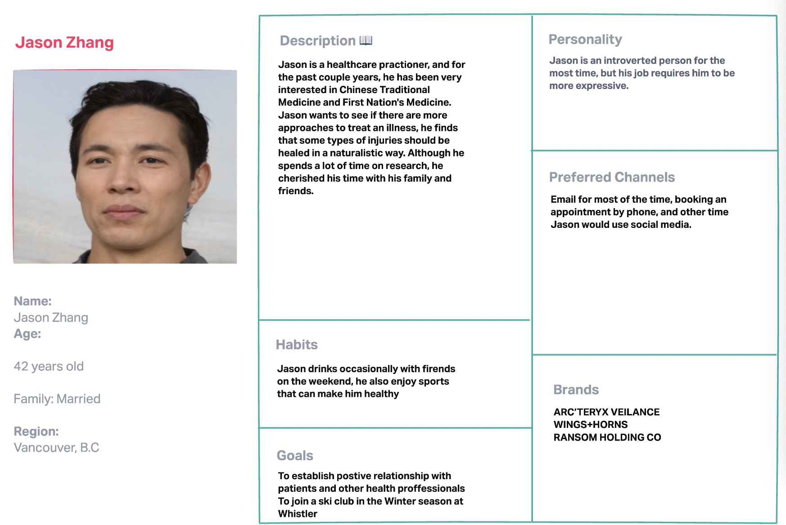
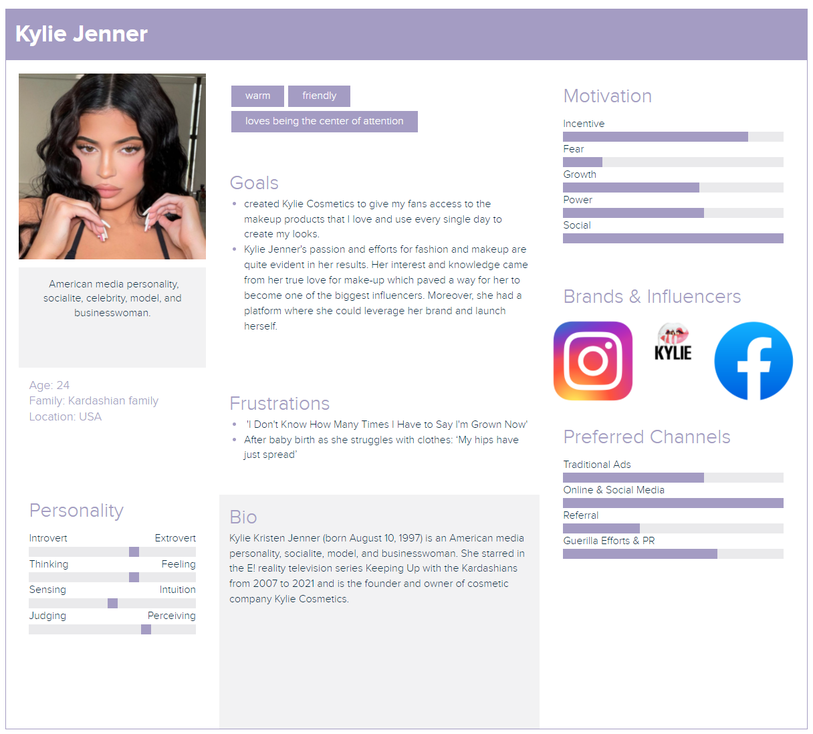

# Facebook
## Persona

## Demographics
✔️ target audience (age, demographics, political leaning, interests, hobbies, etc.)  
Age: In the U.S., 63% of adults (12+) use Facebook and users aged 18+ spend an average of 34 minutes per day on the social media platform. An important note about Facebook’s advertising audience is that there is a good focus on almost all the age groups. Primarily, however, 32% of Facebook’s advertising audience are people aged 25-34.  
Demographics: Amazingly, nearly a third of world’s population uses Facebook at least once a month. Although other social media platforms like TikTok have had a rising popularity over last several years, Facebook is still managing to get engagement from many users around the world. In addition, in terms of gender statistics, 56% of Facebook users are male with 44% being female. Interestingly, nearly 82% of college graduates are on Facebook and are much more likely to use the platform compared to high school graduates. Lastly, as of January 2022, India has the greatest number of users on Facebook (329.65 million), followed by the U.S. (179.65 million).
Political Leaning: Facebook certainly tracks political views of its users and assigns political labels. However, it’s important to note that 73% of people believe that their assigned political label is accurate whereas 27% believe that their political label is inaccurate and doesn’t correctly reflect their political views. In spite of all this, 35% of Facebook users are assigned as liberals, 35% are assigned as conservatives, and the rest (29%) are assigned as moderate.    
Interests:  
“To say that everyone is its target market is not an understatement.” People sign up and use Facebook for a variety of reasons and there are many ways for them to express their interests. Users’ feeds are customized based on the people they follow and things they like such as movies TV shows, artists, books, sports teams, athletes, celebrities, restaurants, apps, and games.  
Hobbies:  
Facebook allows its users to add their hobbies to their profiles so they can find others with similar interest. There are many hobbies that could be added, and they are always shown to public users. One of the main features on the platform is Facebook Groups. It connects people from all around the world based on hobbies or interests, which is proven to be an effective way to build engaging communities.  
✔️ can non-users browse or search content?  
Yes, non-users can use search engines such as Google to search for Facebook profiles, pages, posts, and other content. All they have to do is include the keyword “Facebook” in their web search or more efficiently include “site:facebook.com” to search for content on Facebook only.   
✔️ how are users connected (e.g., on some platforms, you request a connection which needs to be accepted, but on others, you can follow anyone without them reciprocating)  
On Facebook, it’s possible to message anyone without having to send a friend request, but the normal way for people to connect is by sending a friend request. Users can follow pages of celebrities, artists, athletes, etc. without them having to follow back.   
✔️ can content be shared privately?  
Yes, there are multiple methods of sharing content privately with someone else on Facebook. The simplest way is by messaging them directly via Messenger and attaching files. Another method for private sharing is by creating a post on one’s personal feed and customizing the audience for the post so that only specific friend(s) can view the post. Sharing content posted by other users can also be done privately by sending them in Messenger and sharing to the personal feed privately.    
✔️ how is content shared?  
The main method for sharing content is by directly creating a post, which can be customized to be shown to different audiences. Users can photos, videos, and gifs along with other additional content when creating a post. It’s also possible host Q&As, stream live video, tag other people, which provide engagement and dynamic options for users to interact. Moreover, there is an option for people to create private photo or text stories that will be visible for 24 hours on Facebook and Messenger. If users want to share content that other people have created, they can simply go to the post and tap the share button. They can choose one of the following options:  
•	Share Now (Friends)  
•	Share to Feed  
•	Share to Your Story (Friends)  
•	Send in Messenger  
•	Share on a friend’s profile  
✔️ how does content go viral?  
One of the many ways to go viral is to post something that 	is related to the news, trending topics, or other major events that are happening in the real world. There will be many users who are searching and viewing posts about trending topics so there is a higher chance for a post to go viral if it’s socially relevant. In addition, most viral content is short and original. Users have a very short attention span and are often quickly scrolling through their timeline, so if a post catches someone’s attention, it’s very likely that it’s short and doesn’t copy other content.   
✔️ is the parent company public or private?  
Facebook first went public in 2012 as the shares became available for selling in public markets. Note that Mark Zuckerberg announced on Oct. 28th, 2021, that the name of the parent company (Facebook Inc.) is now Meta Platforms Inc.   
✔️ who are the major investors?  
According to Investopedia, the major insider shareholders are Michael Schroepfer, David Fischer, and David Wehner. Also, the major institutional shareholders of the company are Mark Zuckerberg, Vanguard Group Inc., and BlackRock Inc.   
✔️ how does the company generate revenue?  
The company generate most of its revenue by showing digital advertisements. Facebook’s business model is explained simply by Mark Zuckerberg in the video below.   
https://www.youtube.com/watch?v=n2H8wx1aBiQ  
References:  
https://www.investopedia.com/articles/markets/100215/twitter-vs-facebook-vs-instagram-who-target-audience.asp  
https://blog.hootsuite.com/facebook-demographics  
https://www.statista.com/statistics/268136/top-15-countries-based-on-number-of-facebook-users/  
https://www.omnicoreagency.com/facebook-statistics/  
https://www.thecoldwire.com/is-facebook-a-private-company/  
https://qz.com/2081663/why-facebook-changed-its-name-to-meta/  
https://www.investopedia.com/articles/insights/082216/top-9-shareholders-facebook-fb.asp  
https://www.youtube.com/watch?v=n2H8wx1aBiQ  
https://www.pewresearch.org/internet/2019/01/16/facebook-algorithms-and-personal-data/  
https://www.facebook.com/help/378618582856718  

## Privacy and Surveillance

## Social Media and your PLN in Education
