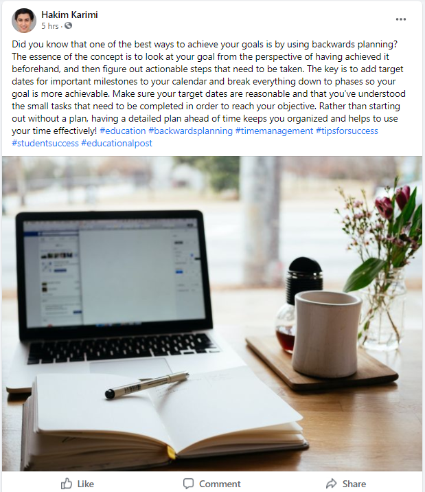

# Facebook  
## Persona  
### Persona 1    
  
  
### Persona 2    
  
### Persona 3    
  
### Persona 4    
  

## Demographics    
### Target audience (age, demographics, political leaning, interests, hobbies, etc.)      
Age: In the U.S., 36% of users who are 45 years old or older use Facebook and users aged 18+ spend an average of 33 minutes per day on the social media platform. [[20 must-know Facebook stats for marketers in 2022](https://sproutsocial.com/insights/facebook-stats-for-marketers/)] An important note about Facebook’s advertising audience is that there is a good focus on almost all the age groups. Primarily, however, 31% of Facebook’s advertising audience are people aged 25-34.  ^[[19 facebook demographics to inform your strategy in 2022](https://blog.hootsuite.com/facebook-demographics)]    
Demographics: Amazingly, nearly a third of world’s population uses Facebook at least once a month. ^[[ Nearly a third of the globe is now on Facebook - chart of the day](https://www.weforum.org/agenda/2019/08/facebook-users-social-media-internet)] Although other social media platforms like TikTok have had a rising popularity over last several years, Facebook is still managing to get engagement from many users around the world. In addition, in terms of gender statistics, 56% of Facebook users are male with 44% being female. Interestingly, nearly 82% of college graduates are on Facebook and are much more likely to use the platform compared to high school graduates. ^[[63 Facebook Statistics You Need to Know in 2022](https://www.omnicoreagency.com/facebook-statistics/)]  Lastly, as of January 2022, India has the greatest number of users on Facebook (329.65 million), followed by the U.S. (179.65 million). ^[[Leading countries based on Facebook audience size as of January 2022](https://www.statista.com/statistics/268136/top-15-countries-based-on-number-of-facebook-users/)]  
Political Leaning: Facebook certainly tracks political views of its users and assigns political labels. However, it’s important to note that 73% of people believe that their assigned political label is accurate whereas 27% believe that their political label is inaccurate and doesn’t correctly reflect their political views. In spite of all this, 35% of Facebook users are assigned as liberals, 35% are assigned as conservatives, and the rest (29%) are assigned as moderate.  ^[[Facebook Algorithms and Personal Data](https://www.pewresearch.org/internet/2019/01/16/facebook-algorithms-and-personal-data/)]         
Interests: “To say that everyone is its target market is not an understatement.” ^[[Twitter vs. Facebook vs. Instagram: What's the Difference?](https://www.investopedia.com/articles/markets/100215/twitter-vs-facebook-vs-instagram-who-target-audience.asp)] People sign up and use Facebook for a variety of reasons and there are many ways for them to express their interests. Users’ feeds are customized based on the people they follow and things they like such as movies TV shows, artists, books, sports teams, athletes, celebrities, restaurants, apps, and games.    
Hobbies: Facebook allows its users to add their hobbies to their profiles so they can find others with similar interest. ^[[How do I add or remove hobbies from my Facebook profile?](https://www.facebook.com/help/378618582856718)] There are many hobbies that could be added, and they are always shown to public users. One of the main features on the platform is Facebook Groups. It connects people from all around the world based on hobbies or interests, which is proven to be an effective way to build engaging communities.       
### Can non-users browse or search content?      
Yes, non-users can use search engines such as Google to search for Facebook profiles, pages, posts, and other content. All they have to do is include the keyword “Facebook” in their web search or more efficiently include “site:facebook.com” to search for content on Facebook only.     
### How are users connected (e.g., on some platforms, you request a connection which needs to be accepted, but on others, you can follow anyone without them reciprocating)      
On Facebook, it’s possible to message anyone without having to send a friend request, but the normal way for people to connect is by sending a friend request. Users can follow pages of celebrities, artists, athletes, etc. without them having to follow back.     
### Can content be shared privately?      
Yes, there are multiple methods of sharing content privately with someone else on Facebook. The simplest way is by messaging them directly via Messenger and attaching files. Another method for private sharing is by creating a post on one’s personal feed and customizing the audience for the post so that only specific friend(s) can view the post. Sharing content posted by other users can also be done privately by sending them in Messenger and sharing to the personal feed privately.      
### How is content shared?      
The main method for sharing content is by directly creating a post, which can be customized to be shown to different audiences. Users can photos, videos, and gifs along with other additional content when creating a post. It’s also possible host Q&As, stream live video, tag other people, which provide engagement and dynamic options for users to interact. Moreover, there is an option for people to create private photo or text stories that will be visible for 24 hours on Facebook and Messenger. If users want to share content that other people have created, they can simply go to the post and tap the share button. They can choose one of the following options:    
•	Share Now (Friends)    
•	Share to Feed    
•	Share to Your Story (Friends)    
•	Send in Messenger    
•	Share on a friend’s profile    
### How does content go viral?      
One of the many ways to go viral is to post something that 	is related to the news, trending topics, or other major events that are happening in the real world. There will be many users who are searching and viewing posts about trending topics so there is a higher chance for a post to go viral if it’s socially relevant. In addition, most viral content is short and original. Users have a very short attention span and are often quickly scrolling through their timeline, so if a post catches someone’s attention, it’s very likely that it’s short and doesn’t copy other content.     
### Is the parent company public or private?      
Facebook first went public in 2012 as the shares became available for selling in public markets. ^[[Is Facebook A Private Company? (Explained)](https://www.thecoldwire.com/is-facebook-a-private-company/)] Note that Mark Zuckerberg announced on Oct. 28th, 2021, that the name of the parent company (Facebook Inc.) is now Meta Platforms Inc. ^[[Why Facebook changed its name](https://qz.com/2081663/why-facebook-changed-its-name-to-meta/)]       
### Who are the major investors?      
According to Investopedia, the major insider shareholders are Michael Schroepfer, David Fischer, and David Wehner. Also, the major institutional shareholders of the company are Mark Zuckerberg, Vanguard Group Inc., and BlackRock Inc. ^[[Top Facebook (Meta) Shareholders](https://www.investopedia.com/articles/insights/082216/top-9-shareholders-facebook-fb.asp)]   
### How does the company generate revenue?      
The company generate most of its revenue by showing digital advertisements. Facebook’s business model is explained simply by Mark Zuckerberg in the video below.  ^[[Senator Asks How Facebook Remains Free, Mark Zuckerberg Smirks: ‘We Run Ads’ | NBC News](https://www.youtube.com/watch?v=n2H8wx1aBiQ)]    

  

## Privacy and Surveillance    
### A link to your platform’s ToS and Privacy Policy  
fb Terms of Service: https://www.facebook.com/terms.php  
fb Privacy / Data Policy: https://www.facebook.com/about/privacy/previous  

### Your key takeaways from your examination of your platform’s ToS and Privacy Policy    
Given Facebook's history with information policy controversy, it surprised none of us to learn that the platforms's ToS and Privacy Policy allows for broad data collection and sharing as it relates to its users. Perhaps unsurprsingly, Terms of Service Didn't Read, a third-party website that assesses and ranks the ToS and Privacy Policies of major companies, gives Facebook an overall E grade. ^ [[Terms of Service Didn't Read: Facebook](https://tosdr.org/en/service/182)] While this is not out of line for other big tech players - Amazon, Youtube, and Reddit all score similarly - the ranking is substandard and reflects little more than a superficial attempt to mask unsettling data management behaviours behind closed doors. Some of the more concerning practices include using cookies for the purpose of tracking, accessing user activity such as private messages and browser history, and sharing said information with third parties to assist targeted advertising.  

Although Facebook does allow users to set information as either public or private, and provides them with tools to further customize the visibility of this data, the platform assumes broad data collection and sharing positions that are carefully crafted to avoid adverse legal ramifications. Their data policy outlines the following reasons for user information collecting and sharing, all of which fall under the umbrella guise of "providing and supporting our Services":  
•	Provide, improve and develop Services  
•	Communicate with you  
•	Show and measure ads and services  
•	Promote safety and security  

Despite the seemingly (and perhaps in some cases, actual) innocuous nature of these justifications, our learning pod found the extent to which Facebook collects user information to be particularly disturbing. According to ToSDR, as per their data policy, Facebook collects "information about the people, pages, accounts, hashtags and groups you are connected to and how you interact with them across our products, such as people you communicate with the most or groups you are part of. We also collect contact information if you choose to upload, sync or import it from a device. [...]. We collect information about how you use our products, such as the types of content you view or engage with, the features you use, the actions you take, the people or accounts you interact with, and the time, frequency and duration of your activities." ^[[Terms of Service Didn't Read: Facebook](https://tosdr.org/en/service/182)] Maybe read that last sentence again. Facebook acknowledges they monitor and collect every minute detail of your online activity, from the people and material you engage with to the amount of time you spend doing so.  

Our concerns are shared with others, as evidenced by a DigitalTrends article titled, "Terms & Conditions: Facebook’s ‘Data Use Policy’ explained", in which the author Andrew Couts echoed similar sentiments. As it relates to Facebook's broad language on this issue, Couts found that the company will collect and use your data as long as it has either:  
•	received your permission  
•	told you it would do so (through the data policy)   
•	or removed any personally identifiable information, such as your name  
As long as one of these three conditions has been met, Facebook reserves the right to use your information to "support our Services". That is broad and troubling language. ^[[Terms & Conditions: Facebook’s ‘Data Use Policy’ explained](https://www.digitaltrends.com/social-media/terms-conditions-facebooks-data-use-policy-explained/)]  

As it relates to tracking user movements, Facebook has vocally dismissed such accusations in recent years. In 2016, Facebook responded to unsupported allegations that it actively listens to user activity and conversations through the microphone of mobile devices by categorically denying such practices. In an official statement, Facebook's parent company, Meta, said, "Facebook does not use your phone's microphone to inform ads or to change what you see in the news feed. [...]. We only access your microphone if you have given our app permission and if you are actively using a specific feature that requires audio." ^[[Facebook Does Not Use Your Phone's Microphone for Ads or News Feed Stories](https://about.fb.com/news/h/facebook-does-not-use-your-phones-microphone-for-ads-or-news-feed-stories/)]. That made us as a learning pod feel slightly more at ease, however a recent 2021 Forbes article titled, "All the Ways Facebook Tracks You and How to Stop It", agrees with the aforementioned points. While Facebook may not be actively listening in on its users, it doesn't need to - it tracks and collects your data with the use of cookies and other methods. It even records your activity beyond the Facebook platform for better targeted advertising - something the company describes as, "a summary of activity that businesses and organizations share with us about your interactions, such as visiting thir apps or websites." We found this to be troubling, particularly the notion that Facebook can be monitoring our online activity in third party apps that may be accessed by, "signing in through Facebook". The number of apps that allow this type of engagement is high and all of us acknowledged signing in by this means, often without giving it a second thought. ^[[All the Ways Facebook Tracks You and How to Stop It](https://www.forbes.com/sites/kateoflahertyuk/2021/05/08/all-the-ways-facebook-tracks-you-and-how-to-stop-it/?sh=a27979355836)]  

Fortunately, some major tech players are taking steps to enhance online privacy and arm users with the tools and awareness they need to opt out of these subtle yet intrusive forms of surveillance. In the recent iOS 14.5 update, Apple introduced a new iPhone privacy feature called App Tracking Transparency (ATT), which allows users to opt out of tracking across other apps and websites by explicitly granting / denying permission in each case. This change denied advertisers a key tracking method known as an IDFA code, which allowed marketers to see how you interacted with and responded to ads across platforms (i.e. see the ad on Facebook, later search it up on Google). ^[[Apple's Stunning New iPhone Feature is a Triumphant Success](https://www.forbes.com/sites/kateoflahertyuk/2021/07/17/apples-stunning-new-iphone-feature-is-a-triumphant-success/?sh=2f9308ee3a1e)]. Obviously, this is a significant win for user privacy and a blow to Facebook's information-harvesting ad machine.  

As a learning pod, we don't have reason to believe there is some sinister plot to use our information beyond the obvious profit-driven, advertising means, however even being exploited towards that end is unsettling. With Facebook's entire business model being built around targeted marketing and advertising, the intentionally vague language of their ToS and privacy policy does little to assuage our data handling concerns.  

## Social Media and your PLN in Education    
### Describe how people are able to interact in your platform. Can people leave comments on content? Is there a quick and easy way to ‘Like’ or ‘favourite’ something? Who sees that ‘like?’ Do creators generally respond to comments on their content?  
People are able to interact on the platform either through liking, commenting, or sharing posts. In order to quickly like a post, users can simply click on the “like” button, but they can also hover the “like” button and choose a reaction by tapping an icon corresponding to Like, Love, Haha, Wow, Sad or Angry. Facebook launched “Reactions” in 2016 in order to give users the opportunity to express how they feel about a post in a quick and simple manner. ^[[Reactions Now Available Globally]( https://about.fb.com/news/2016/02/reactions-now-available-globally/)]   
  
If people want to initiate a conversation about a post they can click on the “Comment” button or the box that says “Write a Comment…”. Along with the comments, users can add emojis, gifs, stickers, photos, or videos. It’s also possible to react or reply to other comments, which is a substantial way for users to communicate on the platform. If people want to "favourite" something, they can select the ellipsis icon at the top right-hand corner of the post, and then choose “Save post/video/link/event”. ^[[How do I save something on Facebook to view it later?](https://www.facebook.com/help/516581611792218)] Some Facebook profiles, pages, or groups are made public, and these normally belong to businesses, communities, public figures, etc. All people can see "likes" from users on different posts, even if they don’t follow these accounts. Regarding posts that show up on the “News Feed”, research indicates that Facebook prioritizes posts that are not business content, meaning that Facebook is used as a platform that prioritize communication on a personal level. In general, established and well-known creators with large followings rarely engage with their audience and mostly share or create posts about their content or brands. However, there are a lot of up-and-coming creators that take advantage of Facebook to engage with their followers and build a larger community. This includes people like Molly Burke, Tom Kerridge, and Agustin Argüello. They were able to increase their content engagement substantially by responding to comments and asking or answering questions. ^[[New ways to engage your audience and build your community](https://www.facebook.com/creators/engaging-audiences-building-community)] Facebook also offers tools such as Creator Studio, which makes it easier for creators to manage their social media presence and interact with their fans. ^[[Creator Studio](https://www.facebook.com/creators/tools/creator-studio)]       
### How do educators use the platform? What kinds of content are they teaching? Who is their audience? Do they respond to comments or questions? Are they using the platform as a PLN, or are they only creating content?  
For this project, our group followed 10 educators on Facebook, and they are all public accounts such as [@Gerry Brooks](https://www.facebook.com/gerrybrooksprin), [@Teaching in the Fast Lane](https://www.facebook.com/TeachingintheFastLane). They would post their content and then tag another educator, or another educational organization. In a recent post by Gerry Brooks, he tagged an Instagram account, which is interesting because when we click on that account, we are directed to the Instagram app. A lot of educators don't reply to the comments, however, they will “like” some interesting comments. The interaction in the comment section is not very active, but we do see some exceptions. For example, [@The Tutu Teacher]( https://www.facebook.com/TheTutuTeacher) is replying to comments and she has over 6000 followers. It’s key to note that each of her posts did not receive many comments, so it’s more manageable for her to respond to most of the comments. In general, some educators are using the platform as a PLN, but we found a noticeable pattern: the more followers educators have, the more they would use this platform to simply share contents, rather than creating a PLN. However, the popular educators would still tag other educators, or repost their content, and comment on them. This may still be considered as interacting with their PLN.      
### In your Learning Pod, plan and publish more than one *SHORT educational ‘post’ (whatever that looks like on your platform). Don’t put huge amounts of effort into your post. A simple ‘ProTip’ or ‘LifeHack’ type of post, or a ‘Did you know…[something you know about…].’ Publish your posts on a few of your Learning Pod’s accounts. How do people respond to your post? Do they respond to the same post differently depending on the persona of the account?  
From the perspective of our first persona, there was little to no engagement with the posts that were created from the account. This is mainly because the profile is fairly new, and it was somewhat difficult to gain followers as a fictitious person. This further emphasized the importance of two-way communication on social media platforms, especially on Facebook. Had the educational posts been published on our personal accounts, the engagement would have been much higher because not only do we follow many pages and profiles, but others also follow us. This creates a strong bond between friends and followers, which is evidently indicates the need of having a Personal Learning Network (PLN) to thrive on social media. It would be interesting to publish the same post on other platforms such as LinkedIn or Twitter in order to see if there will be more engagement. However, the main drawback will be the lack of credibility the fictitious persona has on social media. If someone is not connected to a network of people, then it’s much harder to have meaningful interactions that create ongoing conversations. Thus, being a visitor on Facebook as a fictitious persona seems to be much easier compared to having the same role when using a personal profile. It’s almost impossible to leave no public trace when we interact on social media with our friends and family. Even with enhanced options for controlling our privacy, platforms such as Facebook encourages its’ users to constantly interact, which leads to more public social activity.  
  
  
### Are there any concerns that educators should be aware of regarding your platform (privacy, age-inappropriate content, disinformation, misinformation, offensive or illegal content)?    
They should be aware of the private message scam because as mentioned in previous section, people can directly message others on Facebook without following them. Some scam would try to get one's private message by asking "Is this you?” If they reply, then they may be giving more private information in order to confirm with that person "this isn't me". Also, for an account that is made public, it is best not to share personal information on that account. Some educators made their account private, but they are still able to engage in their PLN. So, if the account is not created to spread the content to a boarder audience, one should protect one's privacy ^[[Facebook Messenger Scams Are on the Rise—Here’s How to Protect Yourself](https://www.readersdigest.ca/culture/facebook-messenger-scams/)]     
### Make note of other things you notice that a curious educator might want to know about your platform.  
This platform allows educators to create groups for classes, which further let’s them to invite students to groups and better communicate with their students. Moreover, Facebook also allows online meetings, so if there's an emergent meeting, Facebook live is always an option. Facebook also allows teachers to create polls, which could be a very good tool for teachers if they want to adjust the syllabus and ask students if they agree to these changes. Furthermore, they could make polls about course evaluations in the middle of semester, in this way, teachers could know if their teaching is working or not working. Teachers could also tag other teachers who teach on the same topic, and maybe share their experience with each other. They could also invite students in the conversation, let them also making connections with a wider educational network. ^[[10 WAYS TO USE FACEBOOK IN THE CLASSROOM](https://www.theedadvocate.org/10-ways-use-facebook classroom/#:~:text=By%20encouraging%20students%20to%20interact,Create%20Facebook%20polls)]    

## Balancing your PLN and Public Discourse      
### How do notable, high-profile individuals use social media?    
Notable, high-profile individuals use social media mainly to distribute business content, using the platform share content and contribute to larger conversation with other notable individuals. Unless some comments attract their attention, they are unlikely to respond to the comment section. The higher the social status they own, the less likely they are going to reply to comments. However, they do tag other notable individuals, that may be considered as their PLN. ^[[The Most Influential Celebrities on Social Media](https://www.usmagazine.com/celebrity-news/pictures/the-most-influential-celebrities-on-social-media/ariana-grande-2-4/)]   
### What are the benefits to being in the public eye and having a PLN?    
Benefits to being in the public eye and having a PLN might include: exchange knowledge, gain more access to resources and build relationship with others. ^[This is a comment.]  
### Building community with online tools provided by an employer can be limiting, what are some possible restrictions and benefits?    
Some possible restrictions and benefits of building community with online tools might be: privacy are more protected. Usually an online tool provided by a company is more safe, because the employers know that the communication involves many business contents that cannot be leaked, so they will choose online tools that could provide them privacy protection. On the other hand, these online tools cannot provide employees an opportunity to connect to wider online users, and this limits their PLN. ^[This is a comment.]  
### Delivering information in a connected society requires verifiable resources, how can you ensure that you build a PLN you can rely on?    
We think we can build a PLN based on the criteria of whether the members in the PLN respect copy rights issue, for example, they know the difference between creative commons and non creative commons. ^[This is a comment.]  
### How do those who are veteran story tellers minimize the risk of sharing misinformation?    
They would know how to evaluate their resources, for example, see if their resources come from a valid source, such as database, notable publications, journals. They would compare different sites' information on the same topic, and deliver their content after they done enough research about it. ^[[Common Resource](https://www.investopedia.com/terms/c/common-resource.asp#:~:text=A%20common%20resource%20(or%20the%20%22commons%22)%20is%20any%20scarce%20resource%2C%20such%20as%20water%20or%20pasture%2C%20that%20provides%20users%20with%20tangible%20benefits%20but%20which%20nobody%20in%20particular%20owns%20or%20has%20exclusive%20claim%20to.)]    
## Digital Identity, Access and Inclusion, and Media Literacy (including Trust and Disinformation)      
### How do you present yourself in social media? Do you have separate identities for personal and work or school use? Do you integrate your personal and professional identities? Do you use different platforms for different purposes?    
I (Wenzhuo) present myself in social media as a visitor, I am not a resident as far as I consider. I often view sites or do research rather than distribute content online. I mainly use Twitter for political news, and YouTube to watch professionals playing games.   
I (Alireza) present myself mostly as a visitor on social media for personal purposes and as a resident for work or school related purposes. There are also cases where I use some platforms for both professionally and personally. For instance, I use Google in order to search for specific content, websites, and keywords. It could be something that I’m curious to learn about or news about Canada, sports teams, movies, and education. In addition, I also often use Google to research about different concepts in my courses. The same thing applies to another Google product that I use, YouTube. I go on YouTube to watch videos about films, sports, news, and music, but I also use it to complement my learning at the university by watching educational videos from channels such as Khan Academy. Therefore, I often integrate my personal and professional identities as it would be somewhat tedious for me to constantly switch between my personal and professional accounts. There are platforms that I use for unique purposes such as LinkedIn for my professional career and connecting with people in the computer science industry, Discord for connecting with my classmates, WordPress for writing blog posts in EDCI 338, etc. In recent years, I’ve become more cautious with the information that I share online, and I try to limit the public trace that I leave on social media platforms.   
### How does the platform you chose for the Major Project incorporate accessibility and inclusion principles. How are disabled people treated on the platform? Are there multiple ways people can consume or produce content to meet accessibility needs? How do you include those who might otherwise be excluded?    
The facebook platform we chose for the major project incorporate accessibility and inclusion principles because everyone have access to the platform without discrimination. However, many of the contents on facebook are not filtered and full of personal bias and misinformation. This means, we could have posts that are discrimnative towards minority groups. ^[This is a comment.]  
### Media Literacy, Trust, and Disinformation Does your chosen platform have content moderation policies? Does it flag disinformation, or provide links to trusted resources? How do you ensure that you don’t spread disinformation as misinformation? (Hint: this last question might require you to do a bit of legwork to learn about Media Literacy.    
Facebook does have a content moderation policies that would flag disinformation, but some sources indicate its moderation policies are a mess. For example, Facebook flags COVID 19's Algorithm as misinformation while it does nothing to warn people about the posts that contains consipracy theories. Moreover, Facebook's algorthims only work in certain languages，^[[Facebook’s Content Moderation Rules Are a Mess](https://www.brennancenter.org/our-work/analysis-opinion/facebooks-content-moderation-rules-are-mess)]. Also, Facebook uses automatic remove system which could open the space for some unethical users to spread hate and discerning messages and get away with it. For example, the platform display photos of animal cruelty, and only when the image is extremly distrubing will it be flagged. Moreover, Facebook's guidelines also allows images or videos of suicide and pornography, which could seriously affect underaged users. ^[Facebook's content moderation rules dubbed 'alarming'by child safety charity](https://techcrunch.com/2017/05/22/facebooks-content-moderation-rules-dubbed-alarming-by-child-safety-charity/)].    
