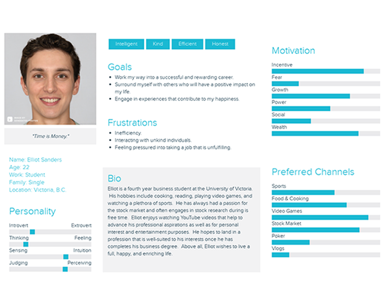
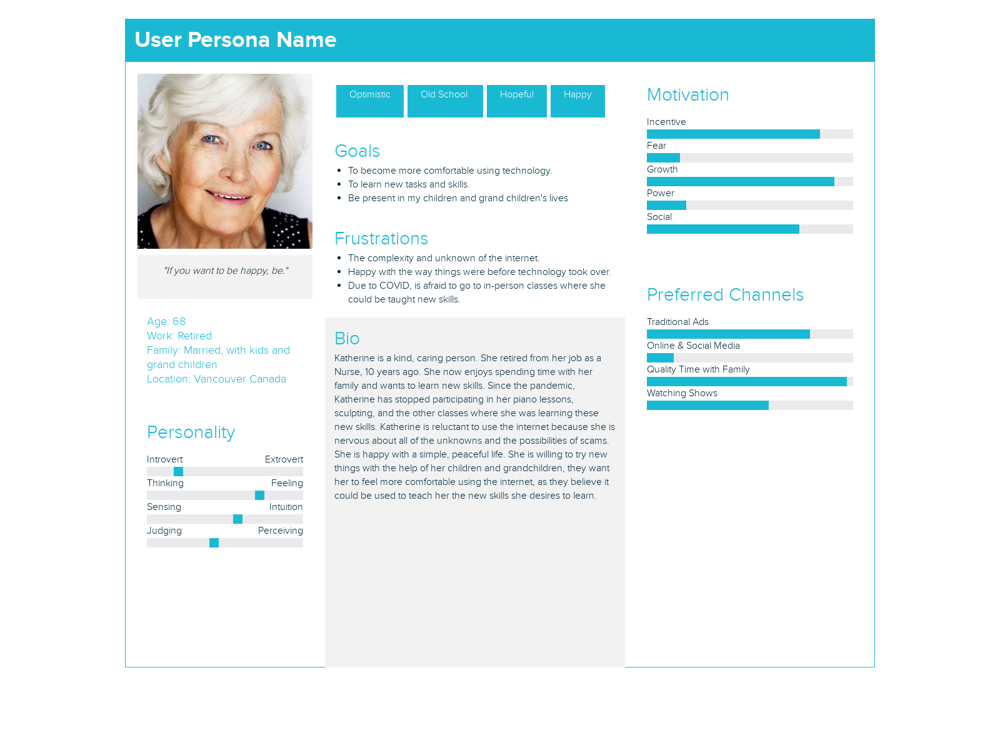
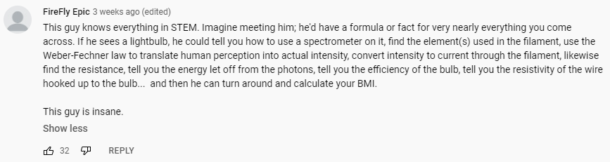
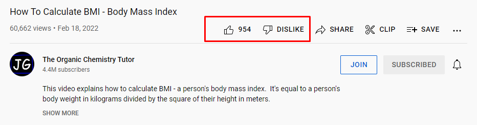
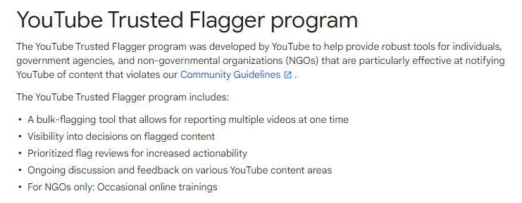
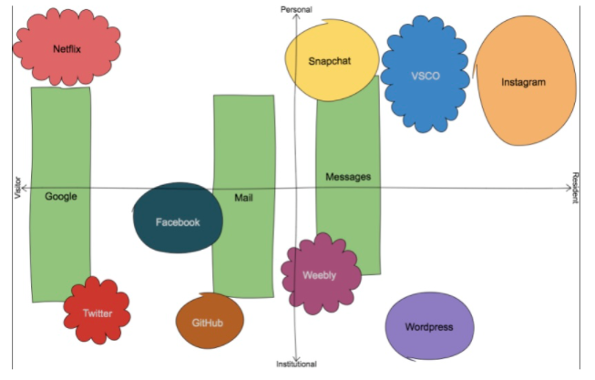
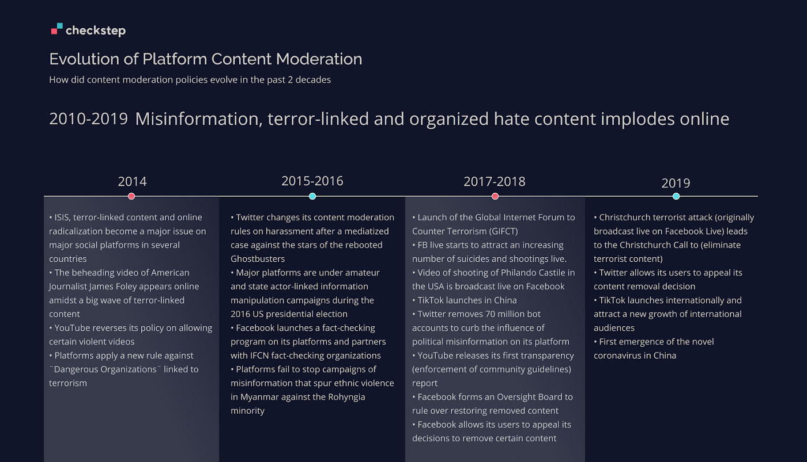

# YouTube

## Personas {-}

## Demographics {-}

### Target Audience {-}
YouTube’s target audience is people of all ages. YouTube has created a “YouTube Kids”, so even young children have to ability to watch videos with their parents being comfortable because the videos on YouTube Kids are appropriate for young children. The gender demographics of YouTube is split very evenly, with a report demonstrating that 45.8% of YouTube’s total advertising audience is female, and 54.2% of YouTube’s total advertising audience is female ^[[Needle, F. (2021). YouTube Demographics & Data to Know in 2021](https://blog.hubspot.com/marketing/youtube-demographics)]. This information is collected from those who report themselves or have their gender shown on their YouTube account. Furthermore, YouTube has launched local versions of the platform in over 100 countries—this demonstrates that YouTube is used worldwide. People use YouTube for many different reasons, some of these reasons are tutorial videos, entertainment, education, mindfulness, to share personal videos, and so on! 

### Searching Content {-}
On YouTube you do not need to have an account to search the content and browse videos. There are some extra features though if you do have a YouTube account. Some of these features include, uploading your own videos, liking videos, subscribing to certain accounts, commenting on videos, more ability to control your privacy, watching videos in incognito mode, and you can create and share playlists. 

### How Users are Connected {-}
You can connect to millions of people on YouTube. The main way people connect is by subscribing to one another. This means that when they post a video it will show up in your “subscription” section. Furthermore, you can comment on and like peoples videos. 

### Content {-}
Content can be uploaded on YouTube in a variety of ways. Videos can be uploaded publicly for everyone to see, but they also can be uploaded privately. Content creators on YouTube get to choose the audience who can see their videos. If a person wants a video to be uploaded but only available for themself to watch, they can upload it privately. There is also a feature on YouTube where you can upload a video but only the people you share the link with can watch the video. 

Any video can be shared through a link. If the video is public and you have access to the link you can share it on your other social media accounts which can help the video gain attraction. Videos go viral by getting a lot of views. If your YouTube account already has a lot of subscribers, it is more likely for your video to go viral, but it is very possible to go viral without having a lot of subscribers. If the video posted is interesting, trendy, and the right people see and share it, it will go viral.

### Major Investors {-}

Photo from: https://fourweekmba.com/who-owns-youtube/ 

### Revenue {-}
There are a few ways that YouTube makes money. The first is through advertising. There are advertisements on YouTube's home page and throughout most of the videos on the site. YouTube also has a monthly subscription service called “YouTube Premium”, which gives them revenue as well. YouTube also developed tools to help eligible creators earn money in a variety of other ways, such as [Super Chat](https://support.google.com/youtube/answer/7288782), [channel memberships](https://support.google.com/youtube/answer/7636690) and [merchandise](https://support.google.com/youtube/answer/9158148). In most cases, creators and YouTube share revenue generated from these channels.

## Privacy and Surveillance {-}

### Terms of Service, Community Guidelines, and Privacy & Policy {-}
* YouTube's Terms of Service: https://www.youtube.com/static?gl=CA&template=terms
* YouTube's Community Guidelines: https://www.youtube.com/intl/ALL_ca/howyoutubeworks/policies/community-guidelines/ 
* Google's Privacy Policy: https://policies.google.com/privacy?hl=en 

### Key Takeaways from YouTube's ToS and Privacy Policy {-}
* There is an age requirement to use YouTube; you must be at least 13 years old and if you are under 18 you need parental permission to use the platform. If you are wanting to use YouTube Kids, children under the age of 13 may use it but a parent has to enable the service for them. This shows that YouTube acknowledges that some of their content is not suitable for everyone
* Content is the responsibility of the person or entity that provides it to the Service
* You are able to report content to YouTube if you think it is inappropriate 
* There are quite a few permissions and restrictions you must follow to be able to use YouTube

## Social Media & PLN in Education {-}

### Platform Utilization & Platform Interaction {-}
Educators, or creators, are able to use YouTube to strike up interesting discussions as well as share knowledge for the desired targeted niche. They may do so by uploading videos to their created profile, or ‘youtube channel’, in which users will be able to access and view their videos at the time of convenience. The types of videos uploaded will depend on the target audience of the educator. For example, [The Organic Chemistry Tutor](https://www.youtube.com/c/TheOrganicChemistryTutor/featured) uploads tutorial videos on organic chemistry, general chemistry, physics, algebra, trigonometry, precalculus, and calculus—his primary audience, in turn, consists of users related to these subjects, most of which are high school students. In other cases, there are educators such as Michelle Emerson’s [“Pocketful of Primary”](https://www.youtube.com/channel/UCf4ktrnK_jWG1mC7U7fNphA) who help fellow teachers lead a healthy teaching lifestyle by sharing ideas on classroom management, lesson planning, and building student relationships. The possibilities are endless and ultimately, it is up to the educator to determine the content they would like to publish. 

YouTube can be utilized as a personal learning network. Besides creating content, YouTube can help foster connections, maintain connections with relevant groups, and also allow for new learning. Each educator will have a unique following, where he or she will be able to interact with their community through a variety of methods. The most common form of interaction are comments—should educators feel the need to respond to a user, they are free to leave a comment. The following are a few other methods of how people interact on YouTube:

**1. Comments**

**2. Likes**

**3. Community Posts**

### Platform Concerns (Privacy, Age-inappropriate Content, Disinformation, etc.) {-}
Educators should be careful of distracting, harmful, and inaccurate videos that are published worldwide across the platform. YouTube’s content is generally not well-vetted, meaning that there is no requirement for published information to be accurate or truthful. In other words, creators and users do not have restrictions on what’s being said or shown through comments or videos ^[[YouTube is major conduit of fake news, factcheckers say](https://www.theguardian.com/technology/2022/jan/12/youtube-is-major-conduit-of-fake-news-factcheckers-say)]. As a result, viewers can easily fall prey to misinformation and disinformation. Violent or sexual content can also be a significant concern. Despite YouTube’s community guidelines, sensitive content still tends to get past regulations.

Fortunately, the platform has resources which enforces reporting and filtering of content such as the following:

- [YouTube Trusted Flagger program](https://support.google.com/youtube/answer/7554338?hl=en&ref_topic=9387085)

- [Restricted Mode](https://support.google.com/youtube/answer/174084?hl=en&co=GENIE.Platform%3DAndroid)

- [Community-Driven Reporting](https://support.google.com/youtube/answer/2802027?hl=en&ref_topic=9387085)

## Balancing your PLN & Public Discourse {-}

### High-Profile Individuals & Social Media {-}
High-profile individuals and their use of social media highly varies with their intent, and more broadly, their ‘branding’. In general, these people are highly looked up to. ‘Branding’, in this case, refers to a person’s reputation composed of unique skills and personality that has the ability to influence a mass of individuals ^[[What is personal branding?](https://www.digitalmarketing.org/blog/what-is-personal-branding)]. High-profile people attract a significant amount of attention online, on television, and so on. These individuals tend to have a big following and are generally scrutinized by the public eye more than the average person. This includes celebrities, musicians, politicians, etc.—depending on the individual’s intent, their platform can be utilized however they see fit, including the good and the bad.

For example, there are celebrities such as [Ryan Reynolds](https://www.youtube.com/c/VancityReynolds) who utilizes his youtube channel to share lighthearted, and fun-loving videos as a form of entertainment. Despite the majority of his videos being published for movie promotions, his way of sharing online information is harmless and full of cheeky humor for everyone to enjoy. In other cases, there are politicians such as [Justin Trudeau](https://www.youtube.com/c/pmcanada) who upload daily youtube videos primarily showcasing crucial remarks on Canada’s political landscape. Through his videos, any individual around the globe who has access to the internet can be filled in on current events and strike up discussion as needed. These are a couple of notable benefits when it comes to being in the public eye and having a PLN, however, it’s important to recognize that at the cost of consuming information, users and educators are also at risk of misinformation.

### Minimizing Misinformation {-}
The best way in spotting and avoiding false information on platforms such as YouTube is to build a sense of awareness and be skeptical of the content that’s being shared or received. According to an article by [The Conversation](https://www.siliconrepublic.com/business/misinformation-social-media-how-to-avoid-spreading), this means taking the following actions:

* Educate yourself - Individuals can be easily manipulated by specific tricks of misinformation. It’s best to conduct your own research and understand how these techniques are being used against you—as a result, you develop a critical eye and become less susceptible to manipulation.
* Recognise your vulnerabilities - Biases can easily sway us. Tread carefully when critical information heavily aligns with your values and what you think is right. It’s just as important to consider other perspectives.
* Consider the source - Be cautious of where the information is coming from. Academic articles that have been peer-reviewed are one of the most credible sources out there, whereas a news article that is not backed by a confirmed expert may not be the most trustworthy source of information.
* Take a pause - When coming across information for the first time, do not believe what you read instantly. Take time to reflect and ask: “Is this information reasonable? Why or why not?”. Explore the content and dig deeper beyond those words.
* Be aware of your emotions - Stay rational! Don’t let your feelings lead you to impulsive behavior that would instigate consuming misinformation
* If you see something, say something - Be proactive in taking action against misinformation. Protect yourself and others by simply pointing out falsified statements rather than doing nothing. 

Ultimately, there is no clear solution in minimizing misinformation. However, what truly matters is the effort put into rationally criticizing what we consume online for the sake of ourselves and for others.  

## Digital Identity, Access and Inclusion, and Media Literacy {-}

### Visitor or Resident {-}
We present ourselves in different ways on social media. The manner in which we present ourselves depends on the type of platform that we are using, the purpose for which we are using a platform, and if we want to be a Visitor or a Resident on the platform. White and Cornu (2011) state that “Visitors are users, not members, of the Web and place little value in belonging online,” while Residents share more of themselves on the Web and leave more of a digital footprint behind when engaging with various online platforms. We find ourselves falling somewhere in the middle of the Visitor/Resident spectrum. By looking at our own data, we are able to see that we tend to act more as Visitors when engaging with platforms such as Google and YouTube as we often use these platforms to seek out information without sharing information about ourselves. For the most part, we also tend to find ourselves acting as Residents when engaging with social media platforms where we share more about ourselves online. These platforms include Instagram, Facebook, and Snapchat. Interestingly, these are also the platforms that we use for more personal reasons. In our case, there seems to be a correlation between personal/Resident.

Below are our Visitor/Resident maps for reference:

### Personal, Work, or School Identities {-}
We have separate identities for personal and work/school use. Our personal identities demonstrate more of our personalities and we are often more casual with the way in which we interact with others. Our work/school identities revolve more around the learning content and we often behave in a more professional manner. For example, if our goal is to keep in touch with others who were previously/are currently in our lives on a personal level, we would most likely use our personal identities to connect with them through social media platforms such as Instagram, Facebook, and/or Snapchat, as these platforms are primarily used for personal purposes. However, if our goal is to collaborate with peers/colleagues for the purpose of professional development or completing a project, then we would most likely use our work/school identity to interact with them through online platforms such as GitHub or BrightSpace, as these platforms are often used for more educational/professional purposes.

### Integration of Personal and Professional Identities {-}
More often than not, we tend to keep personal and professional identities separate. However, there are circumstances where the two identities can be integrated. For example, a blog where we post about subjects that interest us or that we feel passionate about could include both personal and professional identities. Our blogs for this course, EDCI 338, bring out both personal and professional attributes as we discuss topics such as the many ways in which we use technology, our opinions on various topics surrounding the use of technology, etc. Although our blog posts address the content required in this course (professional/educational), we have the option to include our own opinions (personal) as well. YouTube is another great example where we can integrate our personal and professional identities. We use YouTube for personal reasons such as watching videos in our free time that we find entertaining and/or creating content that we enjoy making for others to watch. We can also use YouTube for more professional reasons such as learning about various educational topics, uploading videos to demonstrate our learning in our courses, and/or using videos as sources of information. However, these identities can be intertwined by sharing the ongoing events in every aspect of our lives in our own YouTube channels. A channel can showcase anything that a user wishes to upload, including both personal and professional content.

### The Purpose of Different Platforms {-}
We use different platforms for different purposes online. We use some platforms for personal reasons while we use other platforms for more professional/educational reasons. For example, we use the University of Victoria’s online learning platform, BrightSpace, for strictly professional/educational purposes where we can access assignments and the learning content for our courses, learn from and with our peers through online forums, and be notified of course updates/upcoming events. On the flip side, we typically use social media platforms like Instagram and Facebook for more personal reasons that include staying connected with the people that we meet throughout our lives, posting our own personal content that we wish to share with others, interacting with other accounts that align with our interests, etc. However, since you can have multiple accounts on Instagram, it is possible to create both a personal and a professional account. Nowadays, this is becoming more popular as people can post about their personal life on one account while posting about their work life on another. We are aware of many teachers that have Instagram accounts where they dedicate their posts to lesson ideas, classroom management strategies, classroom organization tips, fun art project suggestions, etc.

### YouTube & Accessibility and Inclusion Principles {-}
YouTube incorporates accessibility and inclusion principles by making closed captions easy to add to videos. Step by step instructions for how to add captions to your YouTube videos can be found here: https://www.ami.ca/youtube-accessibility.

It is also helpful if content creators include the (CC) symbol in their video titles when they include closed captions in their videos to communicate this fact to their viewers ^[[Making Your YouTube Channel Accessible to All Users](https://www.boia.org/blog/making-your-youtube-channel-accessible-to-all-users)]. [Jessica Kellgren-Fozard](https://www.youtube.com/user/MissJessicaKH/videos) is an excellent example of a content creator with a disability who includes captions in her videos in order to reach and include more viewers ^[[Making Your YouTube Channel Accessible to All Users. (2017, October 5). https://www.boia.org/blog/making-your-youtube-channel-accessible-to-all-users](https://www.boia.org/blog/making-your-youtube-channel-accessible-to-all-users)].

### People with Disabilities & Accessibility Needs {-}
YouTube provides content creators with an online space in which anyone can make and view content that pertains to them. While people with disabilities can use the platform, more can be done to increase online accessibility for them and to spread awareness. For example, mentioning the disabled community is a simple and effective way in which content creators can make their channels more accessible ^[[Making Your YouTube Channel Accessible to All Users. (2017, October 5). https://www.boia.org/blog/making-your-youtube-channel-accessible-to-all-users](https://www.boia.org/blog/making-your-youtube-channel-accessible-to-all-users)]. [Annika Victoria](https://www.youtube.com/watch?v=JG9ra7d-Yes&ab_channel=AnnikaVictoria) is another content creator on YouTube with a disability who gives her viewers insights into the living conditions of her daily life. 

There are multiple ways in which people can consume or produce content to meet accessibility needs on YouTube. Content creators can shoot their videos using integrated described video, also known as audio description, as well as “adding narrated video description to the post-production process” ^[[YouTube Accessibility](https://www.ami.ca/youtube-accessibility)] in order to make videos as inclusive as possible for blind and partially sighted individuals. Content creators can also include captions or sign language in their videos in order to reach and include deaf or hard of hearing YouTube users. Additionally, there are even options on YouTube that “allow international viewers to translate your captions into other languages” ^[[Making Your YouTube Channel Accessible to All Users](https://www.boia.org/blog/making-your-youtube-channel-accessible-to-all-users)].

### Media Literacy, Trust and Misinformation {-}
YouTube manages its community and safety through several ways, mainly by both their staff monitoring what people post, but also through listening to other people's comments and concerns about things that have been posted. For creators, they must adhere to the rules that YouTube puts in place. Some examples are copyrights and protecting creators from using other creators' work. However, because of the significant number of creators on YouTube, they rely more on the individual to reach out and inform YouTube regarding a problem. If something violates a rule they have put in place, they do have an algorithm to try and protect the viewers; however, that only protects against misinformation about largely discussed topics, such as harmful conspiracy theories, hate speech, and recently incorrect medical information about COVID. In terms of human staff, there are approximately 10,000 individuals who remove inappropriate videos ^[[YouTube puts human content moderators back to work](https://mashable.com/article/youtube-human-content-moderation)].

While YouTube does have a lot of techniques in place to combat misinformation, it is up to the people on the platform to alert them of the things that slip under the radar. Anything posted or commented on the platform can be reported to the company and consequently be taken down if found to be harmful. However, this does not protect against misinformation that doesn’t violate community guidelines. 

Below is a photo of the evolution of content moderation rules throuhgout the years. The main article linked to this photo can be found [here](https://medium.com/checkstep/the-evolution-of-content-moderation-rules-throughout-the-years-bccc9859cb31).

YouTube does [make the effort](https://www.youtube.com/intl/ALL_ca/howyoutubeworks/our-commitments/fighting-misinformation/) to not recommend or give attention to the videos that spread misinformation, however, there are always cases that blow out of proportion; thus, it is important to fact check things you see on YouTube. The platform ensures that their rules on content creation are very easy to find and that they extensively cover anything that could harmfully affect others. The creation of YouTube Kids is one example that helps younger children not be impacted by harmful content on the platform. 

Mature topics are banned for people under the age of 18 and a lot of misinformation on the platform tends to get corrected by other creators. That being said, blindly looking for correct information on YouTube is a dangerous act—a better solution is to research into multiple sources across multiple platforms and form an opinion from there. Users may also look into credible sources on YouTube who are backed with post-secondary and post-graduate degrees to which they can be informed by. To avoid spreading misinformation as a viewer, it is best to research what you are posting on the platform. Should the content be inappropriate, YouTube will take necessary action in removing the video. To avoid such cases, it is best to be respectful on the platform, ask questions before forming your own opinions, and ensure that you have fact-checked your information properly. The creator also has the ability to remove content if needed.
