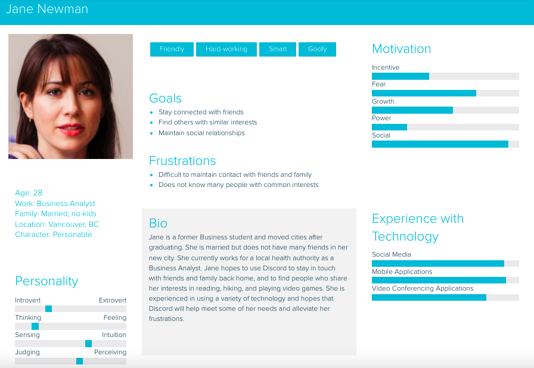
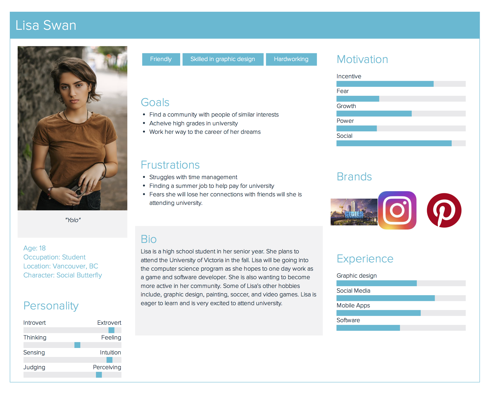
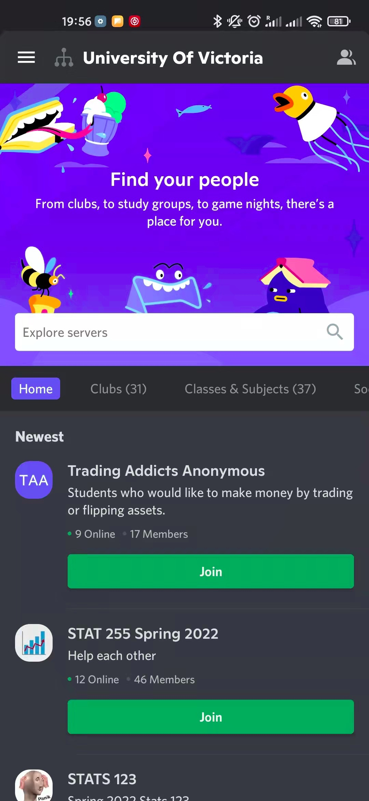
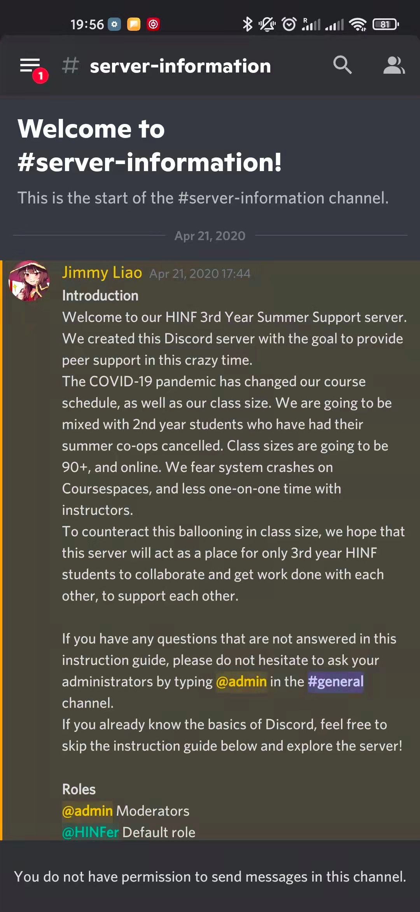

# Discord

## Persona {-}

## Demographics {-}

###  Target Audience and Users {-}
Discord states that the minimum age to access the platform is between 13 and 17 (depending on the country of the user and local guidelines), however these restrictions do not prevent these younger users from accessing the platform. Though there are no official statistics on the average age of Discord users, one site estimates that majority of users are adults between 30-33 years of age ^[[levvvel.com](https://levvvel.com/discord-statistics-and-facts/#:~:text=The%20app%20is%20primarily%20targeting,was%20around%2020%20year%20old)]. Though the creators of Discord made the platform with no targeted users in mind, the platform continues to be widely used by people who play video games as an efficient way to message and chat to others. Discord servers may also be created to connect users with similar interest or hobbies, chats with friends and family, and for educational or professional purposes ^[[https://discord.com/why-discord-is-different](https://discord.com/why-discord-is-different)]. Political leaning of users is varied, and there are many existing servers and communities for users of all positions of the political spectrum.

Individuals do not necessarily need an account to use Discord. One can access servers or communities through a shared link, and are only asked to create a username and agree to Discord’s terms of service. However, if one does not create an account in that session their activity will not be saved ^[[https://support.discord.com/hc/en-us/community/posts/360059214312-Use-Invite-Link-Without-Discord-Account](https://support.discord.com/hc/en-us/community/posts/360059214312-Use-Invite-Link-Without-Discord-Account)].

Discord contains both public and private servers. Private servers are accessed only by an invitation from a member of the group, and are typically used to chat with friends or family members. On the other hand, public servers may be accessed by anyone and are typically larger communities for those with similar interests. Discord also has a friend request feature, where one can accept or reject friend requests.

###  Content {-}

#### Content Sharing {-}
One of the best-known abilities of Discord is group-chatting, which allows content to be shared among individuals in multiple ways.
* Server
The primary way of how discord organizes group chats is through establishing servers, which are chat rooms where users can join to engage each other. Servers can be created for any purpose and can hold up to 500,000 members [5]. While some servers are public for anyone to join, most servers created are private and can only be joined through invitations. Within a created server, content can be shared under two types of channels: text and voice. Text channels enable the sharing of textual information as well as images, emojis, and files. Voice channels are like phone booths where members can engage in voice or video conversations. 
* Group direct messages (DMs)
Another way of how content can be shared on discord is through direct messages. Similar to DM between individuals, group DMs can be used to communicate between multiple members. This content stays only between the members in the group, and both text and voice messages can be delivered within an established group. 

#### Private Sharing {-}
* Direct Messages (DMs)
On Discord, DMs can be sent between different users and allow users to engage in one-on-one conversations. These conversations will not be seen on a public chat server or any members that are not part of the conversation [4].  
* Private server channels
Both text and voice channels within a server can be created as private. This means that only those with permission can access the content within the channel. This can be an effective way to establish conversations between group leaders or administrative personnel.  

#### Viral Content {-}
There are essentially two ways for content to go viral or gain more attention. 
* Discord Nitro
Although discord is a software that is free to download and use, the software offers a subscription service with Discord Nitro. This paid service offers a range of extended features, such as better customizable emojis and upload size for file sharing, but more importantly, it allows a server to be boosted. A boosted server will have both performance and cosmetic improvements such as more emoji slots and better audio and screen sharing quality [6]. These features can help to create high quality and outstanding servers on discord and can largely improve the user experience within the server, which in turn helps to promote any content that is being distributed on the server and attract other members.
* Expanding/advertising the server
Another way of spreading the content or the server is through advertising the server itself. This is a very straightforward way of promoting the popularity or awareness of any content on a server. Spreading the server invitation on other social media platforms can be an effective way. Websites, such as top.gg and Discord.me, ranks servers based on different categories or popularity and allows the public to join the server directly. Another way that can help attract more users is diversifying the members within the server community. Attracting people from various backgrounds can promote a higher level of networking across different fields and the potential for the content to spread across wider areas.

###  Company/Business Details {-}
Co-founders, Jason Citron and Stan Vishnevskiy developed Discord in 2012 and finally launched it in 2015. Since then, Discord has remained a private company, as it is not listed on any stock exchanges. As a result of Discord being a private company, it is not clearly known what sized stake each investor has. However, from when the company first launched, overall ownership has been split between the two co-founders and several other venture capitalist firms [9]. Some of the major investors that helped to finance Discord include [10]:

* Dragoneer Investment Group - Led the most recent funding round of $500 million in Semptember 2021. 
* Sony Interactive Entertainment - Lead investor during secondary market funding in 2021
* Greenoaks - Lead investor for a $100 million Series H funding round in 2020 and one in 2018 with $150 million funding.
* Index Ventures - Led funding rounds in 2020 with $100 million and 2018 with $150 million in funding.
* Greylock - Lead investor for the earliest funding rounds in 2016
* Spark Capital - Partnered with Greylock as lead investors in 2016, funding $20 million. 

Discord collected various rounds of funding over the years and has had many investors to help contribute to the success of the company. Discord over the last two years has been valued at $3.5 billion in the year 2020 and $7 billion in 2021 [12]. Today, Discord’s estimated value currently stands at approximately $15 billion as a result of the funding by Dragoneer Investment Group [11]. 

As Discord does not use ads like many other social platforms, there begs the question of how does Discord bring in revenue?
Discord earns revenue in various ways. Firstly, their main source of revenue comes from the subscription packages that they offer. The premium subscription, Discord Nitro, costs a user $9.99 a month or $99.99 a year, whereas their lower price subscription, Nitro Classic, costs $4.99 a month and $49.99 a year [7]. According to Discords metrics, there are about 150 million active monthly users monthly [8]. Following this they also make money through a 10% cut of titles that game developers sell through verified servers [7]. Notably, Discord also generates a minor amount of profit from the stickers and merchandise they sell, such as branded tee-shirts, hoodies, socks, and more. While there has been no revenue report for 2021, their 2020 revenue was reported to be approximately $130 million [12]. 

## Privacy and Surveillance {-}

### Discord’s ToS and Privacy Policy {-}
Discord ToS: https://discord.com/terms 
Discord’s Privacy Policy: https://discord.com/privacy   
Terms of Service, Didn’t Read overview: https://tosdr.org/en/service/536 

### Key takeaways from examining Discord’s Privacy Policy {-}
Key points from ToS:
* Discord can read your private messages
* Discord can delete specific content with no prior notice and without reason
* Tracks users even if they use the Do Not Track (DNT) header
* No right to a class action
* Can sell or transfer your personal data as part of a bankruptcy proceeding or other type of financial transaction
* Uses your personal data for targeted 3rd party advertising
* Discord has a license on user-generated content even once your account is closed
* Provides info about how they are using your data

Key takeaways:
Discord is given a grade of E by ToSDR. Discord does track you and can read your messages. You have no right to a class action lawsuit against them, and in the case of a dispute, you are forced into binding arbitration. Discord can license user content to third parties. Benefits in Discord’s ToS include that it requires specific consent to share your information with third parties, you can request to access and have your personal data deleted, and they provide information regarding how they will use your data. Overall, by using Discord you relinquish your right to privacy regarding anything you say or do when using the service.

## Social Media and PLN in Education {-}
### Interacting on Discord {-}
Individuals can interact with others using the many features offered within the platform. A user can start Voice Calls, Video Calls, and DM other users. Users can use the “@” symbol in combination with a username to refer to other users. One may “react” to messages through the use of a large list of classic and animated emojis and memes using the Add Reaction (as depicted in the following screenshot). The platform also supports file sharing such as pdfs, Words docs, images, videos and more. 

One may also choose from a variety of other options using the ellipsis located in the far right corner of the message options as shown below.

For video chats, up to 25 individuals can join one session at a time. Within a video session, one can either have their camera on or off, share their screens, and message each other.

### Educational Accounts {-}
One of the ways discord can help educators is through acting as a platform to encourage collaboration and discussion among learners. For members who actively engage in discussions, a well organized educational server can act as a personal learning network to engage with other learners and communicate on common topics.

Code::together (https://discord.me/code)
Code Together is a public educational server on the subject of programming and software development. Members of the server can range from absolute beginners to certified developers. It aims to act as a platform for sharing programming related resources and discuss specific programming problems or challenges. It also has channels for advertising personal or enterprise programming or software development projects. Just like other servers, any messages or posts can be quickly and easily responded to via emojis.Through observation, content is more likely to be responded to by others under channels with specific topics such as a programming language.

The English Hub (https://discord.me/enghub)
Leveraging the benefits of creating voice channels, discord can serve as a great platform for language learning. The English hub is a server targeted for English learning and sharing related resources. Learners at different proficiency levels can engage in discussions on a range of topics and communicate with members from various backgrounds. The text channels are designed with different discussion topics and useful English learning resources such as recommended readings and word-of-the-day. The voice channels act as chat rooms for practicing English speaking and are categorized by the level of proficiency from beginner to advanced.

HINF Connect
HINF Connect is one of the many servers under the University of Victoria server. The university server allows certified accounts users with university email to join clubs, social or study groups, and specific course or academic program servers created by members of the university. This establishes a convenient way for learners from the same program, course, or club to get together and share meaningful content to build a better and more networked university learning experience. The HINF Connect server was created by HINF students from the Class of 2021 but is joined by students from different years of study (including graduate students). Channels are organized by different HINF courses and voice channels act as a great source to conduct group studies. Other resources, including Co-op information, experience sharing from senior students, and industry news are valuable to learners studying in the HINF program.

### Safety Concerns for Educators {-}
To be able to access the Discord website and app, Discord requires its users to be 13 years old and up unless local legislation mandates an older age. To ensure that the age requirement is satisfied, upon creating an account, Discord will ask users to confirm their age. If a user is reported to be under the age requirement, they will be locked out until they can confirm their age with an official ID document. 

Discord contains adult content and is not suitable for young children. Some servers and channels must be labeled as age-restricted for only people over 18 years old to have access.  When someone tries to enter the server, a warning will appear to confirm their age and let them know the server may contain graphic content. Servers that are not labeled- should be reported. 

Discord encourages its users who are under 18 to activate their age-restricted content filter, Keep me safe. This allows Discord to scan images and videos that have been sent through direct messaging and block out any adult material or inappropriate behaviour. This filter can be accessed through the Privacy & Safety section in User Settings. Along with this, users are also able to block any users who they do not want to communicate with. 

## Balancing your PLN and Public Discourse {-}

### How High-Profile Individuals use Discord {-}
As Discord is heavily used by those who play video games, many notable individuals on the platform are in some way related to the video game industry. Many popular YouTubers also have their own Discord servers. Most of these influencers leverage Discord to personally interact with their audience, create a gathering place for fans to interact with one another, and to share related content. Typically, popular influencers create public servers so all of their fans can participate, but some individuals might restrict access in a private server and only grant access to specific individuals (ex: some fans might have to sign up for the influencer’s Patreon in order to be invited to their private Discord group). Unlike most other social media platforms, the discussion features of Discord (chat, voice chat, etc.) are synchronous, meaning users can interact with one another in real-time, leading to improved engagement and conversation in specific communities.
Popular influencers running their own Discord server usually need to enlist a few moderators to ensure that the server is a safe environment for all of those within it.

### Benefits of Being in Public Eye {-}
Most Discord users use the platform because of its anonymity in comparison to other social media platforms, but there are some benefits to having an identifiable public profile for specific individuals. As previously mentioned, popular influencers can host their own servers to create a community where they and their audience can interact with one another. Individuals who run a business might also want to opt for a public profile to attract possible customers, attain customer feedback, and for marketing purposes ^[[https://www.forbes.com/sites/theyec/2021/12/06/what-is-discord-and-can-you-use-it-for-marketing/?sh=3c8148c753fc](https://www.forbes.com/sites/theyec/2021/12/06/what-is-discord-and-can-you-use-it-for-marketing/?sh=3c8148c753fc)]. Students might want to use their real names to connect with their classmates to discuss their classes, assignments, events, and more.

### Building community with online tools provided by an employer {-}
Possible restrictions:
The tools provided may not be ideal for building community
The kind of people you are trying to reach may not use the tools your employer has provided
If you stop working at your current job, you may lose access to the tools and the community you have built

Possible benefits:
Money may be saved if the employer is paying for the tools
Better opportunity to connect with coworkers

### Verifiable resources and reliable PLN
On Discord, public servers can attract members with various backgrounds and the quality of information can be largely uncertain. However, in well-established and organized Discord servers, users can have different roles or tags based on different levels of knowledge or proficiency towards a subject. For example, members of the Code::together server can have the role of a Certified Developer, Moderator, Partner, etc. Tags can be viewed by anyone and can be indicated by displaying different colours on the user name. The collection of roles all hold their different purposes and one can apply for a role after achieving certain requirements. This helps to build one’s credentials and level of authority when publishing any resources and content.

Another way one can build or join a reliable network is through a Verified Server. A Verified Server represents that it is an ‘officially affiliated community of a business, brand, and figure of public interest’, and is presented with a verification icon [14]. The verification process requires the applicant to provide proof of official affiliation with the business or entity as well as the presence of other formal identifications such as websites and social media. Looking for a verified server when obtaining resources can help to ensure the content is more authentic and interact with official representatives from the business or entity.

✔️ How do those who are veteran story tellers minimize the risk of sharing misinformation?

## Digital Identity, Access and Inclusion, and Media Literacy {-}

### Digital Identity {-}
With social media and online platforms rapidly advancing, we engage with them in both personal lives and professional settings. Therefore, it is important to separate the use of social media under different settings or environments, giving us the opportunity to interact with digital tools under different identities. 

Commonly, during work or in other professional settings (i.e., universities), we are provided with designated channels of communication, such as Brightspace, WordPress, and Microsoft Teams. Separating the use of different tools actively provides us with the opportunity to differentiate interactions between work/study and personal life. However, this may not be the case if one social media platform is being utilized in different ways. For example, we can have both professional and personal Discord servers on one account, or have group chats with both friends and work colleagues on Messenger.

Different platforms can also influence the extent to which we present our ‘real’ self or the digital and ‘fictitious’ self. We may introduce the more genuine side of ourselves when with networking platforms such as LinkedIn, but remain more anonymity in social platforms such as TikTok and GitHub. This could again be related to the different purposes of use, which is whether it is for more professional purposes or leisure purposes. 

However, it is worth realizing that sometimes it is not easy to explicitly differentiate our personal and professional identities. One might want to take advantage of some of their professional achievements or profile and use that to promote their level of influence or popularity in other fields of personal interest. For example, a professional software developer could earn more respect when engaging with friends on a gaming network.

### Access and Inclusion {-}
How does the platform you chose for the Major Project incorporate accessibility and inclusion principles. How are disabled people treated on the platform? Are there multiple ways people can consume or produce content to meet accessibility needs? How do you include those who might otherwise be excluded?

Discord has a dedicated Accessibility section, which can be found in User Settings > App Settings > Accessibility. There are options for reduced motion, auto-playing GIFs, playing animated emojis, and text-to-speech settings [15]. According to an article comparing Slack and Discord’s accessibility settings, Discord leaves much to be desired [16]. Screen readers read out form field labels but not the values entered, and using private chat is difficult. As of the article’s writing in January 2021, there was no sound alert for direct messages in Discord, no “send” button when chatting, and no sound alert for sending direct messages [16]. 

Discord has safety principles and policies, but not any direct policies on accessibility and inclusion that we could find. However, Discord does have a blog post on racial equity, stating that they are dedicated to fighting abuse and harassment [17]. This is an empty statement when not paired with direct policy regarding inclusion. Discord has a Head of Inclusion, Diversity, and Purpose, and in August 2021 stated that they are “building a team with a focus on equity and social justice” [17]. They are also focusing on hiring individuals from underrepresented groups [17]. This is stated in a blog post, but is not found in any official policy or principles on Discord’s website.

Overall, Discord does not do the best job of being accessible and inclusive. There are many features missing in terms of making the platform accessible for individuals using screen readers. Further, despite having a Head of Inclusion, Diversity, and Purpose, Discord does not have diversity and inclusion principles, which it should implement. 

### Media Literacy, Trust, and Disinformation {-}
Media literacy is an important structure for navigating all information we encounter, especially on social media platforms where anyone is able to spread disinformation. Media literacy provides us with the tools to analyze and be critical of the information that we come across and to be cautious when creating media content. It is very important to be able to assess all information that we are given and determine whether or not it is accurate and can be verified. 
Discord has recently updated its community guidelines to address disinformation and misinformation. These new guidelines highlight that users cannot share false or misleading information on Discord that is likely to cause physical or societal harm. [18] There will now be a general ban on sharing content that can influence or sway people’s opinions through the use of “sensationalized, alarmist, or hyperbolic language, or any content that repeats widely-debunked health claims, unsubstantiated rumours, or conspiratorial narratives” [18].  Users are encouraged to flag and report any disinformation/ misinformation that is found to be harmful. Some of the content that is banned and will be removed includes [18]:
* Anti Vaccination content;
* Medically unsupported and dangerous cures for diseases;
* Content that distorts information about a disease; and,
* Any content that could hinder the resolution of a public health emergency.

Discord plans to take action against the spread of misinformation violations by giving a warning to an accounts and servers, suspending accounts, removing harmful content, and permanently disabling an account or server. Overall, Discord strives to keep its platform a safe place for individuals to connect online and build strong communities. 

## References {-}
[1] https://levvvel.com/discord-statistics-and-facts/#:~:text=The%20app%20is%20primarily%20targeting,was%20around%2020%20year%20old. 
[2] https://discord.com/why-discord-is-different   
[3] https://support.discord.com/hc/en-us/community/posts/360059214312-Use-Invite-Link-Without-Discord-Account   
[4] https://www.alphr.com/discord-dm-someone/#:%7E:text=Discord%27s%20direct%20messages%20allow%20you,you%27re%20all%20currently%20engaged  
[5] https://www.pcmag.com/how-to/what-is-discord-and-how-do-you-use-it  
[6] https://www.wepc.com/tips/what-is-discord-server-boost/  
[7] https://www.cbinsights.com/research/report/how-discord-makes-money/  
[8] https://discord.com/company  
[9] https://www.wepc.com/tips/who-owns-discord/   
[10] https://pcstrike.com/who-owns-discord/   
[11] https://www.bnnbloomberg.ca/chat-app-discord-is-worth-15-billion-after-new-funding-1.1652842]   
[12] https://www.businessofapps.com/data/discord-statistics/  
[13] https://www.forbes.com/sites/theyec/2021/12/06/what-is-discord-and-can-you-use-it-for-marketing/?sh=3c8148c753fc
[14] https://support.discord.com/hc/en-us/articles/360001107231-Verified-Server-Requirements
[15] https://support.discord.com/hc/en-us/articles/1500010454681-Accessibility-Settings-Tab
[16] https://equalentry.com/slack-vs-discord-which-is-better-for-screen-readers/ 
[17] https://discord.com/blog/an-update-on-racial-equity-at-discord-through-inclusion-diversity-and-purpose-efforts 
[18] https://discord.com/blog/addressing-health-misinformation
