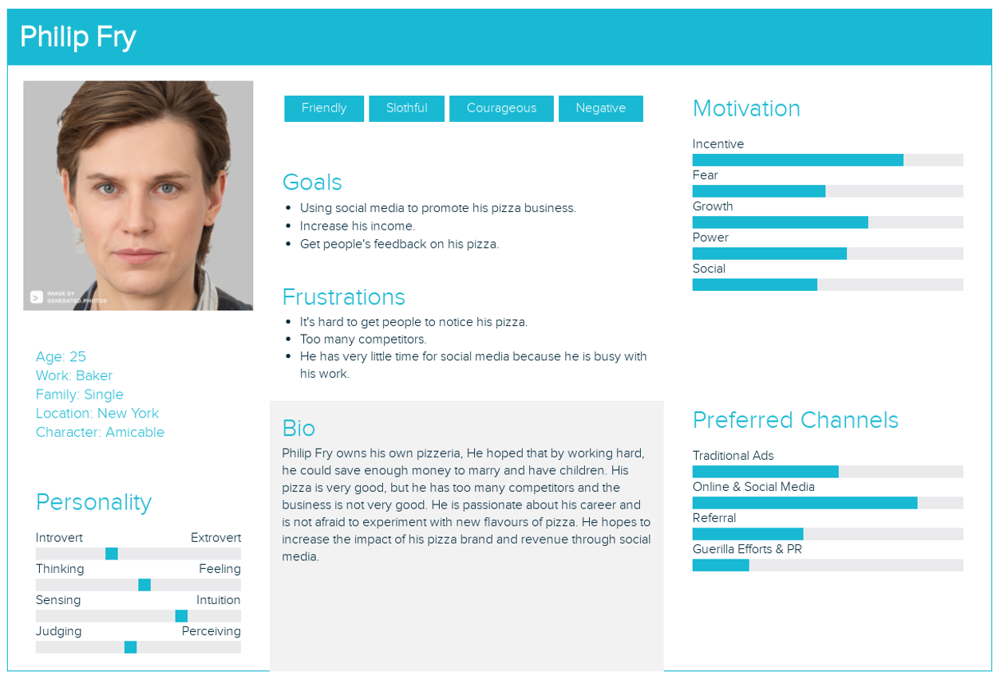
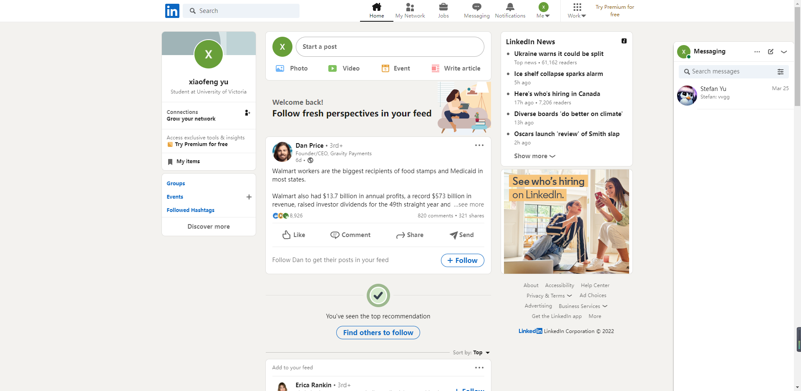
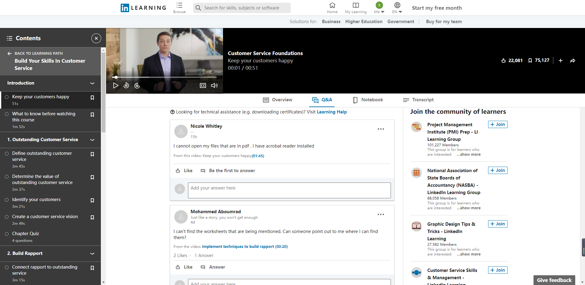
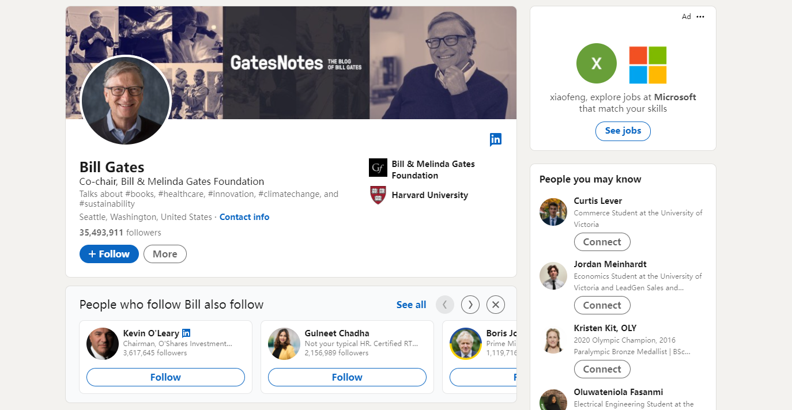
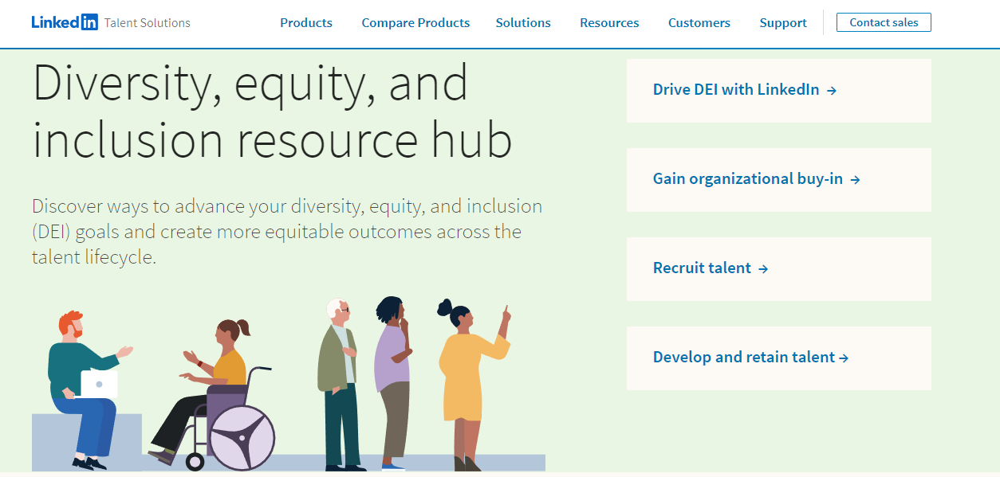

# LinkedIn
## Persona

## Demographics 

✔️ Target audience (age, demographics, political leaning, interests, hobbies, etc)

* LinkedIn has 675+ million users worldwide. Their users tend to be over 18 years old. Their users are looking for jobs or maintaining relationships at work. According to user surveys in the United States, up to 37% of users are 46-55 years old.

✔️ Can non-users browse or search content?

* Non-users can browse and use the search function. Comments and conversations require registration to use.

✔️ How are users connected (e.g., on some platforms, you request a connection which needs to be accepted, but on others, you can follow anyone without them reciprocating)

* Users in Linkedin need to add each other as friends before they can chat privately. There's also a premium service that sends messages directly to strangers, but there's a monthly limit.

✔️ Can content be shared privately?

* Yes, Linkedin can choose to make your posts public or only to your friends.

✔️ How is content shared?

* Users can choose to post their own posts, and if the content is public, it will appear on your profile page. Users also can share content by leaving comments in other people's posts. Users can also private message content to designated users (friends must be required).

✔️ How does content go viral?

* Linkedin users can post their own public posts, which are seen by strangers when others search for keywords related to your posts. If your post is viewed and commented on by a large number of people, it will appear further up the page and more likely to be seen by strangers. Some big corporate posts are also very influential because they have a large following.

✔️ Is the parent company public or private?

* The parent company for Linkedin is Microsoft and it is a public company.

✔️ Who are the Founders?

* Reid Hoffman & Eric Ly

✔️ How does the company generate revenue?

* Linkedin generates revenue through advertising, offering talent solutions, marketing solutions, and premium accounts.

## Privacy and Surveillance

✔️ A link to your platform’s ToS and Privacy Policy

* Terms of use : https://www.linkedin.com/legal/l/service-terms

* Privacy policy : https://www.linkedin.com/legal/privacy-policy?trk=content_footer-privacy-policy

✔️ Your key takeaways from your examination of your platform’s ToS and Privacy Policy

* Linkedin users use the site primarily for job hunting and professional networking. Companies and individuals are required to be truthful in their job postings, and Posting false job postings is considered a violation of the terms of use.

* Users are required not to provide false personal information, which is a violation of the terms of use if it is found to be false during the job search process.

* Linkedin automatically recommends your information and posts to people who need you, which doesn't violate Privacy Policy.

## Social Media and your PLN in Education

### Interact on Linkedin {-} 
* People who sign up for Linkedin can leave comments or "likes" on public posts made by other users. At the bottom of each post is a quick marker, there are six different ICONS representing different meanings, they are Like, Celebrate, Support, Love, Insightful, Curious. You can support a post by leaving a quick mark under it, so that's going to make this post more propagating. If you are interested in this post, you can leave a comment below the post. Linkedin also supports photo commenting. Creators tend to pick the best comments to respond to, which makes the post even better.

### Educators in Linkedin {-} 
* Unlike other social software, Linkedin gathers many elites in various industries, who share and teach their own industry experience, so it is easy to find relevant industry expertise here. Linkedin offers a paid teaching model that allows users to find relevant courses, enter the program, and then get certified. Educators can teach by creating their own curriculum. Educators can also teach by Posting public posts to their accounts. Of course, creating your own paid courses will be more professional and more easily searchable by those who need them. Paid courses on Linkedin are mostly for career-related skills. For example, under the customer service category, you can find training courses on how to handle customer complaints. People looking for customer service jobs on Linkedin will most likely take classes on how to handle customer complaints. In these paid courses, students can receive instructional videos, exercise files and relevant student group chat information. Also, you can leave a comment below each course video to help other learners or solve your own questions. There is a scoring system for each lesson, because only the person who has attended the lesson can mark it, so the learner can decide whether to pay for the lesson.
* In Linkedin educators using the platform as a PLN, Paid courses not only have reviewable videos, but more importantly, there are many related group chats that give learners a place to discuss the course content and master the knowledge. A place where you can communicate, learn and update your knowledge is PLN.
* Educators need to pay attention to the quality of the course in paid content. At the same time, there should be no wrong information or information violating the terms of use in the teaching video.

### Verified account {-}
* Teaching content posted by an ordinary account is difficult for others to find because they won't be recommended at the top of the list. At the same time, most people are not interested in what a regular account (with few followers) posts, and are more likely to read professional looking posts.

## Balancing your PLN and Public Discourse

✔️ How do notable, high-profile individuals use social media?

* Celebrities often use Linkedin to share updates related to their field of expertise or events they attend. What celebrities share on Linkedin is less entertaining than other social apps.

* For example, Bill Gates posts on his personal page about his activities related to the economy.

✔️ What are the benefits to being in the public eye and having a PLN?

* To being in the public eye and having a PLN will give you a reputation, and your account will be more valuable as more people follow you. (Advertising, etc.)

* On the other hand, you can easily gather more people in the same field, which is very good for knowledge acquisition and exchange.

✔️ Building community with online tools provided by an employer can be limiting, what are some possible restrictions and benefits?

* Restrictions - The functions of the community will be limited, The community tends to be more formal.

* Benefits - easier to join the community, save more money.

✔️ Delivering information in a connected society requires verifiable resources, how can you ensure that you build a PLN you can rely on?

* It starts with choosing the right people’s posts. It is best to have certified individuals or high-profile individuals.

* You can then compare the information to see if it's correct by comparing what different people have posted about it.

* Choosing authenticated group chats increases the accuracy of messages.

* In conclusion, the more famous the account or group chat will be more reliable.

✔️ How do those who are veteran story tellers minimize the risk of sharing misinformation?

* Double-check the accuracy of the information before posting a post.

* Add a note to your message or add a note in the comments.

* Promptly address questions and comments in the comments section.

## Reflection

### Digital Identity {-} 
* Personally, I tend to separate my personal identity from my professional identity. I don't show my personal life very often on social media, and there is even less personal information on some social media that I don't use very often. I use different social software for different purposes. When I need to find a job, I will definitely use Linkedin instead of Facebook because Linkedin's target audience is professionals. At the same time, I think the social media recording my life status should be more entertaining and should not involve my work content, which will help me relax. Reducing the amount of irrelevant content on social media for work can increase my level of trust.

### Access and Inclusion {-}
* Linkedin does a good job of being inclusive as a job search social media. Linkedin have “Diversity, equity, and inclusion resource hub” to help people be more inclusive. Specific methods include Unconscious Bias course, Hide Candidate Photos And Names, and Gender Diversity Insights. I think Hiding the candidates' photos and names is the most inclusive. As long as their abilities are recognized, they can be recruited to work through companies on Linkedin. In addition, all paid courses have subtitles, so that more people can access and study.

### Media Literacy, Trust, and Disinformation {-}
* Linkedin has a moderation policy that removes messages if they are judged to be disinformation or violate the terms of use. Linkedin bans all violent and bullying content, which is easy to spot and quickly removed. Some disinformation is not easy to distinguish, the platform can not mark disinformation, but the platform has a report function, when someone found disinformation, and then report, the platform will verify and decide whether to forcibly delete the disinformation. Media literacy is what every Internet user must have and learn. Social media have formulated terms of use to reduce the occurrence of illegal information, but there are still a lot of disinformation on social media platforms. The first place to distinguish disinformation is in the comments section, if someone spots it first, you can prevent it from spreading again. You can also check for accuracy by comparing other people's posts. You can even address questions directly to the creator in the comments section. Because so many people use Linkedin to recruit and apply for jobs, identifying and reducing disinformation is very important for the platform.

## References {-} 
1. https://blog.hootsuite.com/linkedin-demographics-for-business/
2. https://www.linkedin.com/learning/topics/customer-service
3. https://www.shiftelearning.com/blog/personal-learning-networks
4. https://business.linkedin.com/talent-solutions/diversity-equity-inclusion#dei%20journey
5. https://business.linkedin.com/talent-solutions/diversity-equity-inclusion/recruit-talent#all-topics/all-content-types
6. https://www.linkedin.com/legal/professional-community-policies
7. https://www.linkedin.com/learning/working-with-upset-customers-2/3507835?autoplay=true
