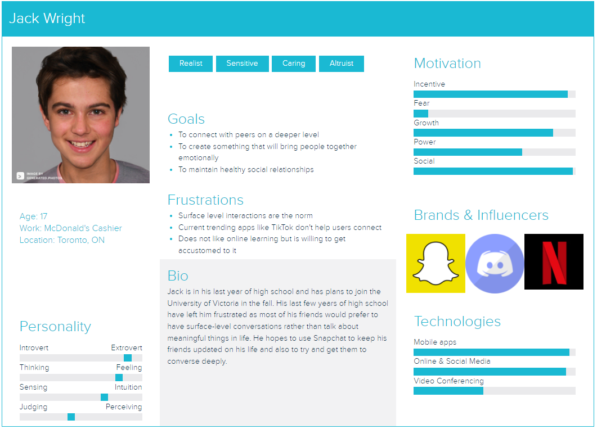

# Snapchat

Snapchat is a popular messaging app that lets users exchange pictures and videos (called snaps) that are meant to disappear after they're viewed. It's advertised as a "new type of camera" because the essential function is to take a picture or video, add filters, lenses or other effects and share them with friends.

## Contents {-}
1 Personas
2 Demographic Information
3 Privacy and Surveillance
3.1 Link to Snapchat's ToS and Privacy Policy
3.2 Key takeaways of Snapchat's ToS and Privacy Policy
3.2.1 How they gather information
3.2.2 How they share information
3.2.3 How they store information
3.2.4 Grey areas about Snapchat's Privacy Policy. 
4 Social Media and your PLN in Education
5 Balancing your PLN and Public Discourse
6 Digital Identity
7 Access and Inclusion
8 Media Literacy (including Trust and Disinformation)
References

## 1 Persona {-}

## 2 Demographic Information {-}

### 2.1 Target Audience {-}

With over 319 million daily active users, Snapchat is mainly targeted towards Millennials and Generation Z [6]. Teens and young adults engage in this platform as the self-destructing image feature takes away the permanence of sharing images online. Individuals of other age groups do not partake as much on this platform, mainly due to the nature of how content is shared. The gender demographics of Snapchat is split quite evenly, with 54.4% of users identifying as females and 44.6% identifying as males.

### 2.2 Connecting with others {-}

Non-users cannot peruse content on the platform. As it is a person-to-person platform, having an account on the app is required. Users connect with each other by adding others as friends, much like other popular messaging platforms like Facebook. They can also subscribe to influencers and pages under the Discover section, found when swiped right from the camera screen. In recent years, Snapchat has allowed users to create group chats consisting of 100 people. Anyone is able to add people to the group even if the admin of the group isn’t their friend.

### 2.3 Sharing Content on Snapchat {-}

The primary purpose of the app is to share content privately. The app was originally intended to be a person-to-person communication platform. Users send another person a photo/video/text message which disappears after the allotted time set by the sender, has passed. With group chats, people are able to share content with multiple people at once. Users can share ‘Stories’ which are snaps viewable by all their friends, that are only available for 24 hours. Individuals can also create filters and lenses and post them to be used by others in the community, under Lens Explorer. Users can subscribe to their favorite Lens and the creator, to stay up to date with their latest creations.

Attaining virality on Snapchat is not like other platforms. Users can post videos up to 60 seconds long onto Spotlight, attaching relevant hashtags and hoping that it gains enough traction for it to go viral. If it does go viral, they can then get paid for it through third-party payment providers.

### 2.4 Company Details {-}

Snapchat is owned by Snap Inc. which went public in March of 2017 under the trading symbol SNAP.

**Screenshot from: https://money.cnn.com/quote/shareholders/shareholders.html?symb=SNAP&subView=institutional**

Snapchat generates revenue primarily from digital advertising services, which consist of augmented reality ads, Snap Ads and tools to measure advertising engagement.

**Photo from: https://whatisthebusinessmodelof.com/business-models/how-snapchat-makes-money/**

## 3 Privacy and Surveillance {-}

### 3.1 Link to Snapchat's ToS and Privacy Policy {-}

Snapchat's Terms of Service: https://snap.com/en-US/terms
Snpachat's Privacy Policy: https://snap.com/en-US/privacy/privacy-policy

### 3.2 Key takeaways of Snapchat's ToS and Privacy Policy {-}

#### 3.2.1 How they gather information {-}

First, they learn about you when you use their service. While you may not tell them you’re a sports fan, if you’re always watching basketball highlights on Discover and your Bitmoji is wearing your team colors, it’s a safe guess.

Second, they learn from whatever information you choose to give them. For example, when you set up a Snapchat account, we learn your birthday, email address, and the unique name you’d like to go by.

Third, they sometimes learn about you from other people and services. For example, if a friend uploads their contact list, they might see your phone number. Or, if you tap on an ad for a video game, the advertiser may let them know that you installed it. 

#### 3.2.2 How they share information {-}

When Snapchat shares information, it’s usually because you ask them to — like when you access Snap Map or send a Chat to a friend. Some of your information, like your username and Snapcode, is visible to the public by default.

#### 3.2.3 How they store information {-}

Snapchat is about living in the moment. That's why when you send a Snap or Chat, it's deleted by default after it's viewed or expires. Messages may remain if you or your friends saves them in chat. 

#### 3.2.4 Grey areas about Snapchat's Privacy Policy {-}

Snapchat had a recent privacy policy update where they collect log information such as details about how you’ve used our services, device information such as your web browser type and language, access times, pages viewed, IP address, identifiers associated with cookies or other technologies that may uniquely identify your device or browser and pages you visited before or after navigating to our website.

As with any service, it's important to read the terms of service and privacy policy you agree to. Thankfully, Snapchat's is written without much of the legal jargon companies frequently use to obfuscate their shady tactics.

## 4 Social Media and your PLN in Education {-}

## 5 Balancing your PLN and Public Discourse {-}

## 6 Digital Identity {-}

A digital identity is the body of information about an individual, organization or electronic device that exists online. People present themselves differently online and on social medias based on what they are trying to acheieve. Each platform is different from the others due to their distinct unique selling points. 

For example, LinkedIn is the world's largest professional network on the internet. You can use LinkedIn to find the right job or internship, connect and strengthen professional relationships, and learn the skills you need to succeed in your career. Snapchat, on the other hand, is primarily used for creating multimedia messages referred to as "snaps" that can consist of a photo or a short video, and can be edited to include filters and effects, text captions, and drawings. It empowers people to express themselves, live in the moment, learn about the world, and have fun together. 

When someone is in a search for a job online, they would have a professional profile picture along with their qualifications on the business media site, such as LinkedIn, to impress employers to hire them. They would only include career related information on this site. On the contrary, if the same person wants to share some jolly family photos with their friends and family, they would post them on their personal social media site such as Facebook or Snapchat. Facebook and Snapchat are platforms where people share more about their lifestyles.

## 7 Access and Inclusion {-}

## 8 Media Literacy (including Trust and Disinformation) {-}

## References {-}
[1] https://snap.com/en-US/terms
[2] https://snap.com/en-US/privacy/privacy-policy
[3] https://snap.com/en-US/privacy/your-privacy
[4] https://www.businessinsider.com/snapchat-privacy-policy-update-explained-2015-10
[5] https://www.linkedin.com/help/linkedin/answer/a548441/what-is-linkedin-and-how-can-i-use-it-?lang=en
[6] https://www.omnicoreagency.com/snapchat-statistics/

