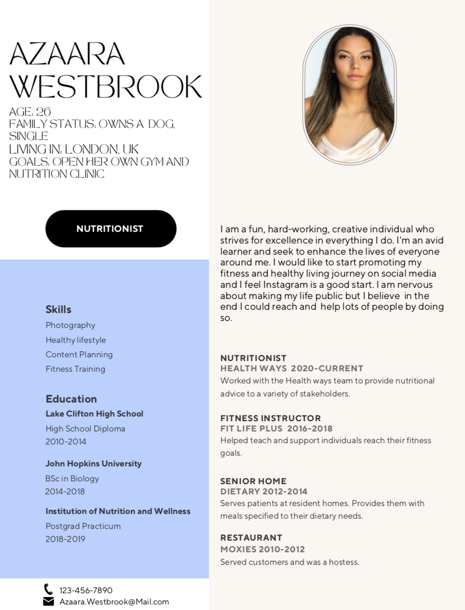

# Instagram

## Personas

## Demographics 

Target audiance (age, demogrraphics, political learnings, interests, hobbies)

Instagrams target group is more so directed towards a younger demographic.It is demonstrated that 75% of users are between the ages of 18 and 24 years old. 
https://nealschaffer.com/instagram-target-audience/#:~:text=The%20Instagram%20demographic%20shows%20that,25%20and%2029%20years%20old. (add hyperlink) 

## Digital Identity 

## Privacy and Sureillance 

## Access and Inclusion  
Inclusive design aims to provide the user with a good experience. It is known as shifting away from the idea of “one-size-fits-all”. And moving towards creating a design for a diverse range of users. Accessibility on social media platforms is in relation to recognizing exclusion and displaying information in a clear manner. 
Instagram provides the following to increase inclusion and accessibility:
- Automatic captioning
- Alt-image descriptions
- Include descriptive captions
- Screen reading
- Adjust text size
- Manage video captions 
Following are the ways in which people can produce content to meet accessibility needs:
- Writing in plain language
- Adding hashtags and mentions
- Limit emoji use
- Avoid special characters
- Descriptive image captions
- Use good color contrast: Avoid color contrasts that are difficult to read
- Promote positive inclusion 

## Trust and Misinformation 
Instagram works with third party fact checkers to identify, review and label false information. Additionally, instagram also has multiple community guidelines for user motivation to continue being an authentic and safe platform. 
Those guidelines include: 
- Users should only share content that they have right to share 
- Users may only post comments that are appropriate for a diverse audience 
- Users must follow Law and not spread misinformation in relation to sensitive topics such as:
    - Bullying 
    - Alcohol 
    - Tobacco products 
    - Hate 
    - Sexual services 
    - Drugs
- Users must respect all members of the instagram community

## Public Discourse 
High profile individuals usually use instagram for different reasons, it could be to interact with more people, or for promoting a brand through their pictures and videos, or could also be to share important information/content. 
Some benefits of being in the public eye and having a PLN are:
- Individuals can interact with more people in an easier way
- Make relationships with high profile individuals 
- Gain more knowledge for products/companies/brands interested in 
Some benefits of building a community with online tools by an employer is that the tools created could be safer than social media tools. This is because on social media tools everything is open source and all the information is public. Whereas a tool made by an employer can be more private and could follow security guidelines for employee safety. 

We can ensure that a PLN is safe and reliable if users follow the guidelines set by the community. 

Veteran story tellers could connect with third party fact checkers to identify misinformation. Or they could also use different sources to find information and cross check if the information matches. 

## Education 

## Media Literacy 

## Reflection 

## Resources 
