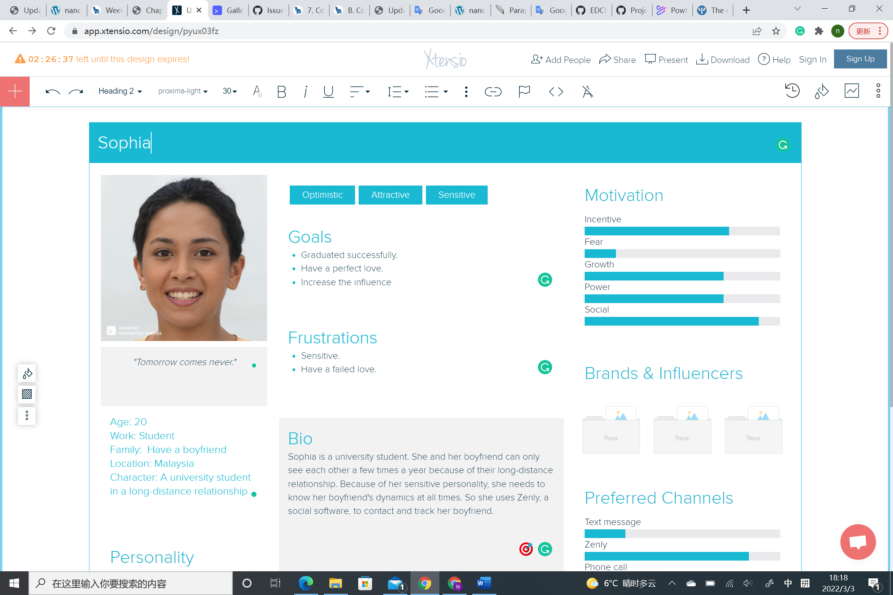

# Zenly
## Persona

## Demographic
✔️ target audience (age, demographics, political leaning, interests, hobbies, etc)
Friends and family members. Zenly is popular among teenagers. Zenly is an app that combines three functions: social, messaging, and mapping. Over 2 million people have downloaded the Zenly so far.
✔️ can non-users browse or search content?
Non-users cannot browse or search content. You must first sign up.
✔️ how are users connected (e.g., on some platforms, you request a connection which needs to be accepted, but on others, you can follow anyone without them reciprocating)
When using Zenly, if users want to connect with other users, they must request to add other users as friends, and this request requires the other user's acceptance. Only after the two users become friends, then they can chat with each other, view each other's location, etc.

✔️ can content be shared privately?
Yes, Zenly provides private sharing and communication between friends and family. Zenly also provides privacy settings, you can only open it to some of your friends.

✔️ how is content shared?
Zenly mainly provides basic location sharing, and friends can roughly know the specific places you have been to and slept through through the app. This also forms your own social map to share with your Zenly friends. zenly presents your life experiences by displaying your best friends and favorite places in the app. For example, your best friend will appear larger than others so you can connect with them. Zenly's feature is that you can exchange emoticons with your friends, which is a cool way to communicate.

✔️ how does content go viral?
Zenly's dissemination method is to add friends to disseminate content by adding address book, user name and mobile phone number, touch and so on. zenly will send you push notifications in the following situations: when a friend accepts your request, when a friend receives a message, when a friend adds you to a gadget, when a friend's location changes. For example: when they travel to another country, such as the United States. Of course, if you don't want to receive push notifications, just turn them off in settings or check your Zenly notification preferences.

✔️ is the parent company public or private?
The parent company Snap Inc. is an American camera and social media company, founded on September 16, 2011. by Evan Spiegel, Bobby Murphy, and Reggie Brown based in Santa Monica, California.

✔️ who are the major investors?
According to the Crunchbase, the major investors are Benchmark, Peter Fenton, Jerry Murdock, Xavier Niel, and Olivier Thomas.
Those investors have invested $22.5 million. 

✔️ how does the company generate revenue?
Zenly does not have subscription and in-app purchase. The company will develop its own data mapping system to provide users with its own brand services. 

## Privacy and Surveillance
