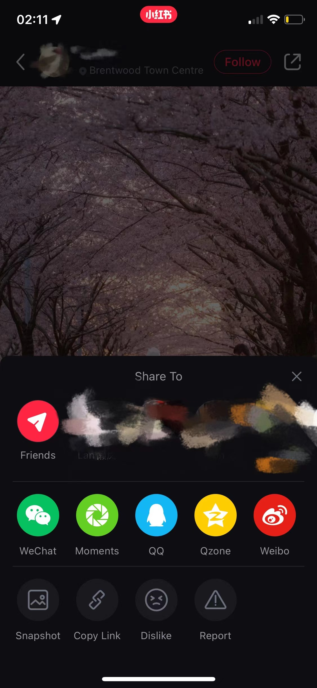

# RED 

## Personas

## Demographics
Target Audience
RED is a Chinese social media and e-commerce platform launched in 2013 with more than 300 million users and monthly active users on RED exceed 200 billion on 2021. Of RED’s 300 million users, about 80% are female and 70% are Millennials or members of Generation Z. Typically those using the app have higher than average disposable income. RED is used by Chinese people in China and around the world. We describe RED as a combination of Instagram, Pinterest and Amazon, where people can review products and share their shopping experiences with a vast community. Users post product photos with reviews and tips for other users to read, comment, and save to their boards as you would on Pinterest. Also, you can follow influencers and shop online within the RED app. 

### Can non-users browse or search content?
For non-users, if you download the app RED on your phone, you are required to create an account in order to browse and search within the platform. However, if you are using the RED’s website, you can have a quick browse of a few selected posts, but it is limited to 1 page, if you wish to browse or search more, you need to download the app. You can browse a post without creating an account only if when an existing users share the post as a link to you. 

### How are users connected?
On RED, if user wants to be connected to another user, you can simply follow them and you can follow anyone without them reciprocating. However, in terms of messaging, if the user you follow did not follow you back, you can only send three messages in total until they follow you back. 

### Can content be shared privately and how is content shared?
Yes, on RED, users can only the content privately use the following options: 
  1.	Directly message to user you follow
  Users can share the content as a direct message to any user you follow
  2.	Generate a link or QR code
  Users can also generate a link or a picture of QR code of the content they wish to share
There is also an option to share publicly:
  1.	Share via another social media platform
  You can share the content via three Chinese social media platforms: Wechat, QQ and Weibo, RED will first get approved to connect itself to the app user     selected, then user can select if they want to share to the social media as a private message or a public post.

### How does content go viral?
Content on RED can go viral if the post is in the Explore section, which means there will be more users can see the post because most of the users will only browse the Explore section. Also, including a hashtag in the post can also help content to go viral. The screenshot below is an example of the Explore section, and you can tell most of the posts went viral. 

### Company details
RED is founded in Shanghai in 2013 as a user-generated content community, and RED completed Series D fundraising with a valuation of over 3 billion on 2018. The main investors are listed below: 

## Privacy and Surveillance

### Privacy Protection
https://www.xiaohongshu.com/en/privacy_protection

### Privacy Policy
There are only Chinese version available and I still list the link below
https://www.xiaohongshu.com/privacy

### ToS
There are only Chinese version available and I still list the link below
https://www.xiaohongshu.com/terms

### Key takeaways
After the authorization, RED allows to record image, voice, or video. According to the Xiaohongshu Intellectual Property Protection Policy, when others try to download my post images or blogs, it shows my own logo on images or blogs.

## Social Media and your PLN in Education

### How do people interact on RED?
RED is a platform for people to share and record their lives. The blog is based on their experiences and daily life. Visitors could double click on the images to express their liking of the content or leave comments in the comment section. Most of the creators love to reply to the comments and discuss.!

### How do educators use the platform?
An example of a music instructor
He Juan is a vocal instructor. She usually posts her content as a video. It is more convenient for her to show how to pronounce words and how to breathe properly. Since she teaches the pronunciation of each word, her audience is more suitable for beginners. The comment section is dominated by compliments or anticipation of her next instructional video content that is to her liking.

### Posts and feedback
When we posted a note about a statistics class, one third of the reviewers were interested in the helpful post, such as which textbook the note was from or asking questions about the ununderstood part of the problem solving process. The rest of them say thank you. 

We also did a post about restaurants in Vancouver. Comments on this type of post fall into three categories. One is to collect our posts; the second is the affirmation and love of people who have been to the restaurant; the third is their dissatisfaction and complaint based on the experience they once visited, but the third group is in the minority. 

<!--

-->

In Red, the chances of a post being picked up are driven by likes and location. So most people respond differently to similar types of posts. What they respond to depends on the content of the post. If it's the same post, they may not respond to the same post twice. Because of this mode, the way they reply is not based on a Persona of account.

### Concerns that educators should be aware of regarding RED
As for my platform, educators should pay attention to copyright issues. As my answer to the last question, we can find many similar posts, such posts may be by some public accounts to transfer other people's work for profit. It's so common that visitors don't really care who the original post is. Unless our account is one with a lot of followers, that might be a bit of a deterrent.

### Things we notice that a curious educator might want to know about RED
Because our platform is a kind of sharing platform. Anything you want to know will be posted by a relevant person based on his experience. But one of the most fascinating things about our platform is that different people, different identities and different ages give different summaries. For example, when you want to remember a word, a professional will tell you what the word means. But in Red, there are also non-professionals who may be students or homemakers or whatever, who share their own ways of memorizing words. Learning about different summaries and experimenting with different approaches is perhaps the most attractive aspect of the platform.

## Balancing your PLN and Public Discourse

### How do notable, high-profile individuals use social media?
As we all know, there is not only one person running the account on the social platform of well-known celebrities. Behind each well-known account there is a team, one part is responsible for publicity, one part is responsible for video editing and manuscript editing, one part is responsible for business docking, and the most important one is responsible for the “performance” in front of the screen.

### What are the benefits to being in the public eye and having a PLN?
Celebrities use social platforms for profit and business. By accumulating a certain number of fans to obtain the cooperation opportunities of the brand side.

### Building community with online tools provided by an employer can be limiting, what are some possible restrictions and benefits?
Building a community using employer-provided online tools may involve copyright issues. Some platforms cannot have politically relevant content posted, and the content posted can be partially restricted. Content posted on employer-provided platforms needs to be vetted or authenticated and does not allow you to post what you want as a private user, and more needs to match the employer's requirements. Some restrictions include copyright issues and the need to sign a contract for the content posted. For example, if you have already set up an account with an online tool provided by the employer, the content you post on this platform is not allowed to be posted elsewhere under the contract terms.
The advantage of using an employer-provided online tool to build a community is that you have a regular group of followers. The platform can provide certain guarantees and policies to protect your interests and privacy. Compared to employer-provided platforms, your private community is relatively unstable. The content posted may be stolen, copyright issues may arise, and there is no formal platform to protect your rights favorable.

### Delivering information in a connected society requires verifiable resources, how can you ensure that you build a PLN you can rely on?
This can be done by providing relevant information to obtain official review and certification or reliable copyright. Accurate name authentication, identity verification can be a source of account reliability. For example, on Red, you can prove your professional background or identity by providing professional certificates such as documents and information. The certified icon will be shown on the homepage to prove the authenticity and reliability, thus ensuring that the PLN is dependable. In most cases, reliable users have many followers, as these certified accounts are more reliable than private accounts. However, it is not possible to judge an account's credibility based on the number of followers. Quality accounts are more likely to attract followers.

### How do those who are veteran story tellers minimize the risk of sharing misinformation?
Before releasing information content, you can obtain reliable sources through regular channels, first self-audit, and then go to the relevant authoritative information. For example, on Red, most people share their personal experiences, and if it is health-related, the publisher has a formal nutritionist, fitness coach and other professional qualifications. Alternatively, when releasing information, they also share reliable information to ensure the reliability of the content. Most storytellers focus on sharing content related to their professional background, reducing misinformation through self-vetting and professional knowledge.

## Digital Identity, Access and Inclusion, and Media Literacy 

### Digital Identity
We choose to show a more positive side of ourselves on social media by sharing our daily interests, such as desserts, food, landscape photos or favourite movies.
All of our team members have multiple social media accounts, the social media we all use for sharing school and study-related content including Facebook, Messenger and Discord, and in terms of sharing our daily life, the social meadia platforms we use are RED, Wechat, Instagram and Weibo. 
We separate our personal and professional identities and use different social media when dealing with different people. We are more likely to use Facebook to communicate with classmates at school and WeChat to communicate with friends in our daily life.
To conclude, We choose different platforms for different use, and what we have in common is that Facebook and Messenger are usually what we choose for study-related content. 

### Access and Inclusion
The platforms do not limit the people who use them, giving equal opportunities and access to the general public. Some social media nowadays will provide extra help to people with disabilities, such as voice broadcasting and sign language videos, which improves the principle of inclusiveness and accessibility in using the platforms. Moreover, nowadays, people with disabilities are treated very well on many platforms because some platforms will help promote content related to people with disabilities and encourage people to help these disadvantaged people because on online platforms actively, people are more sympathetic to people with disabilities, and when you go to search some homepages or personal accounts of people with disabilities, most of the comments underneath are from people who are encouraging and supportive. When consuming or producing on the platform, people can meet accessibility needs through sign language videos, voice broadcasting, or there will be professional service providers to help. Those who may be excluded can be helped by providing exceptional services such as a special hotline or service staff. Some anchors will post videos that encourage people to help people with disabilities to support them actively. By appealing to people through their traffic, they can include people who may be excluded.

### Media Literacy, Trust, and Disinformation

The content published on Red needs to pass the audit, and each platform has a particular audit policy. In order to avoid spreading false information, the content that needs to be published needs to pass the verification of accurate and valid information. There is no way for false information to pass the audit, and if you need to buy goods on the platform, you will be provided with direct links to reliable and regular resources for purchase. In order to ensure that false information is not disseminated as misinformation, the content must first be vetted before it is posted to ensure that the source of the resource is reliable and regular and that certain guarantees are in place. After guaranteeing reliable resources and audits, publishing the relevant content can largely avoid false information.

## Reference
[1] https://www.xiaohongshu.com/en
[2] https://www.latmultilingual.com/blog/understanding-red-the-chinese-shopping-app/
[3] https://en.wikipedia.org/wiki/Xiaohongshu

